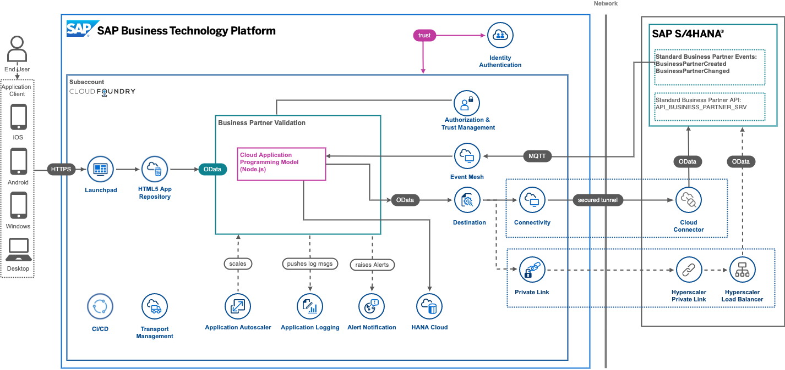

## Deprecation Notice

This public repository is read-only and no longer maintained.

---

# XP262 - How to Build Business Extensions and Implement Use Cases on SAP BTP

## Description

This repository contains the material for the SAP TechEd 2022 session called **XP262 - How to Build Business Extensions and Implement Use Cases on SAP BTP**.  

## Overview

This session introduces attendees to the general concepts of building extensions for SAP systems (like SAP S/4HANA, SAP SuccessFactors and the like) with the help of SAP Business Technology Platform (SAP BTP). Instead of building our own extension app, we will take a different approach in this advanced session: Understanding an app that already exists and is running, diving into the most important aspects of such an app and setting the foundation for more complex scenarios. 

The Discovery Center Mission [*Enhance core ERP business processes with resilient applications on SAP BTP*](https://discovery-center.cloud.sap/missiondetail/3501/3542/) serves as the foundation for this session. This session will cover the foundation of its architecture.

## Requirements

There are no requirements for this session other than a browser (preferrably Google Chrome). Unfortunately, since the entire environment is already prepared for attendees including the SAP S/4HANA on premise system, these exercises can only be done on-site at SAP TechEd 2022 in Las Vegas. 

## Procedure

If you complete an exercise early, please resist the urge to go on to the next one. Instead, investigate what you've just done and see if you can learn more about the subject that was presented. That way, we can avoid having to answer every question several times and really ensure that all questions can be addressed.

**IMPORTANT:** The instructions in the following exercises contain more than just the actual steps you have to do. To not get confused, we have highlighted the steps where you actually have to do something with this pointer: 👉. Everything else is intented to provide more background information.

## Exercises

- [Exercise 0 - Getting Started](exercises/ex0/)
- [Exercise 1 - Get to know your own extension application artifacts on SAP BTP](exercises/ex1/)
- [Exercise 2 - Explore SAP Event Mesh in action](exercises/ex2)
- [Exercise 3 - Logging and Monitoring capabilities of SAP BTP with Application Logging service and Kibana Dashboards](exercises/ex3/)
- [Exercise 4 - Get in touch with the data persistency: SAP HANA Cloud](exercises/ex4/)
- [Exercise 5 - Discover the connectivity options of SAP BTP by utilizing SAP Cloud Connector and SAP Private Link service](exercises/ex5/)

## How to obtain support

Support for the content in this repository is available during the actual time of the online session for which this content has been designed. Otherwise, you may request support via the [Issues](../../issues) tab.

## License
Copyright (c) 2022 SAP SE or an SAP affiliate company. All rights reserved. This project is licensed under the Apache Software License, version 2.0 except as noted otherwise in the [LICENSE](LICENSES/Apache-2.0.txt) file.
