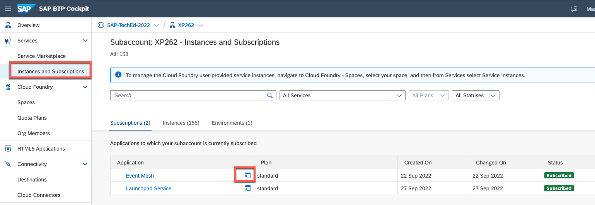

# Exercise 1 - Explore SAP Event Mesh in action 

In many cases, typical extension applications for any LoB system today are based on event-driven architectures. An event-driven architecture, which is popular in modern applications built with microservices, uses events to trigger and communicate across decoupled services. An event is a status change or an update, such as a new created or update Business Partner. 

Event-Driven architectures usually consists of three components: 

- **An event producer:** In this case the SAP S/4HANA system 
- **An event broker:** In this case the SAP Event Mesh service on SAP BTP
- **An event consumer:** The CAP (SAP Cloud Application Programming Model) Node.js application deployed to SAP BTP, Cloud Foundry runtime

Let's have a look at your extension application what it all looks like in action. 

## Exercise 1.1 Get to know the SAP Event Mesh management dashboard

SAP Event Mesh is a fully managed service on SAP BTP and offers a management dashboard out of the box. This gives you the opportunity to interact with Queues, Subscriptions and many more artefacts via the UI as an alternative to the [REST APIs for SAP Event Mesh](https://api.sap.com/package/SAPEventMeshDefaultPlan/rest).

👉 Go back to your SAP BTP subaccount overview (you should have bookmarked this page in the previous exercise).
👉 Navigate to **Instances and Subscriptions** and open the SAP Event Mesh management dashboard via the link next to the Subscription name. 

## Exercise 1.2 Check out the queues in the SAP Event Mesh management dashboard

The SAP TechEd instructors have already deployed

👉 Leave this browser window or tab open, so you can observe in parallel how SAP Event Mesh behaves on certain actions you execute. 

Exercise 

## Exercise 1.2 Check the status of your application using the SAP BTP Cockpit
## Exercise 1.3 Create a new business partner in SAP S/4HANA using the SAPGUI
## Exercise 1.4 Observe the event consumption in SAP BTP Cockpit and SAP Event Mesh management dashboard
## Exercise 1.4 Start your application and the event consumption 
## Exercise 1.5 Check the SAP Fiori application to find your business partner

## Summary

You've now seen how the CAP (SAP Cloud Application Programming Model) application on SAP BTP is getting notified about changes on business objects in SAP S/4HANA. SAP Event Mesh enables the source system to function independently of potential interested parties. The source system remains completely unaffected whether 50 or 100 event consumers are connected, or whether certain consumers are not online at the time. As a result, SAP Event Mesh enables the decoupling of producers and consumers.

Continue to - [Exercise 2 - Exercise 2 Description](../ex2/README.md)

