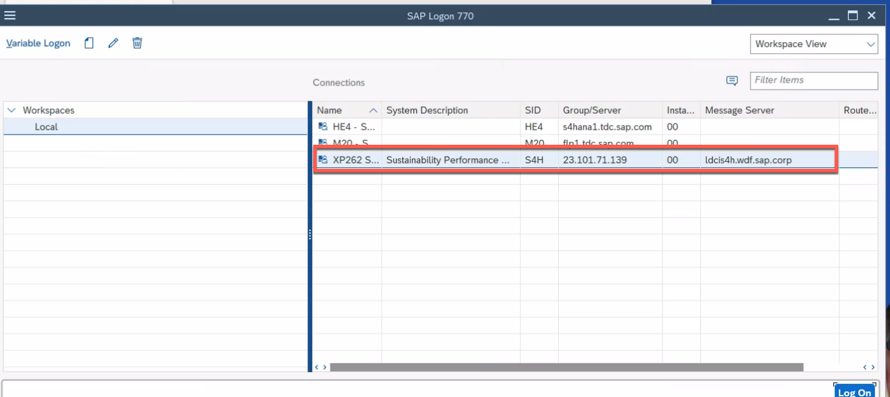
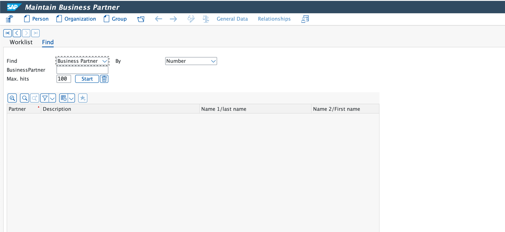
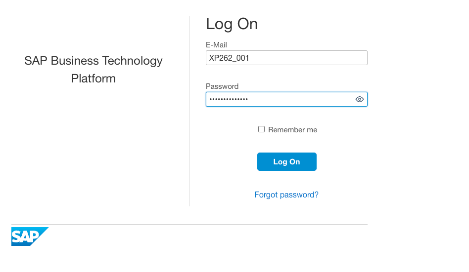
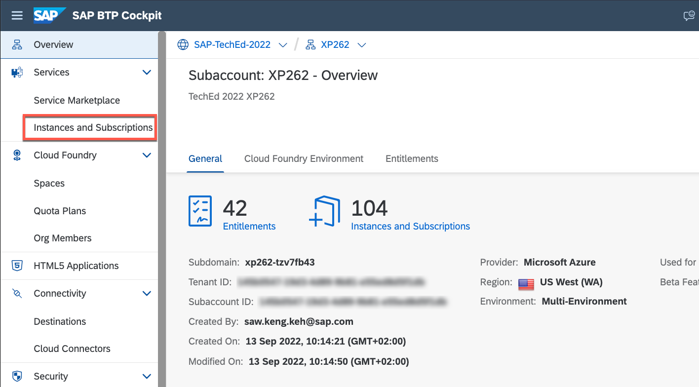
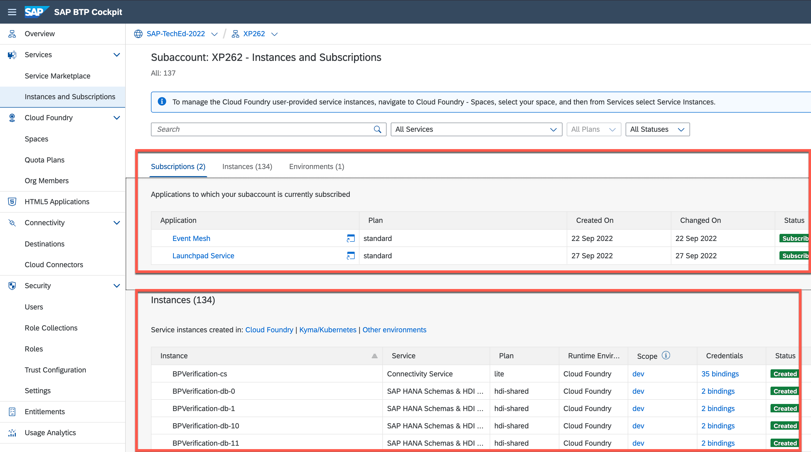
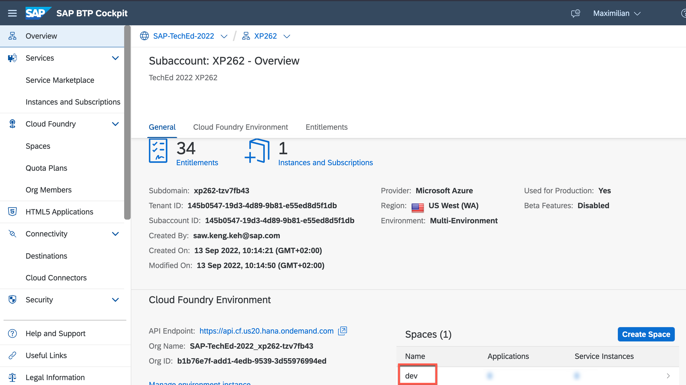

# Exercise 0 - Getting Started

Before you start work on the existing extension application, let's make sure you have all of the tools you need to complete this session successfully. This exercise will give you a few login credentials that you will need to remember throughout the session. **Please do not use any other user than the one assigned to you.**

There are only two accounts that you need in the entire session. Both of them are provided by SAP, please do not use your own user accounts for the subsequent exercises.

--- 
**IMPORTANT**: A student number has been given to you. You will repeatedly see the placeholder **\<STUDENT>** throughout the entire session. Please replace this placeholder with your own student number whenever it's needed.

For instance: Student number 37 has been given to you. You receive the following task in one of the exercises: "*Please filter for BPVerification-srv-\<STUDENT>*."
Therefore, you would have to filter BPVerification-srv-37.

**IMPORTANT**: We will sometimes provide links to the source code of artifacts that you are going to use. This is for additional information only. You don't have to develop anything, customize code or deploy any MTAs in this session. These links are therefore purely for additional information and are by no means action items for you!

## Exercise 0.1 Test SAP S/4HANA access

The _source system_ for our extension application is an SAP S/4HANA on-premise system. You will mostly work in the transaction **BP** to create/modify business partners which will trigger events for SAP Event Mesh, or to check changes to business partners that have been made using the SAP BTP extension application. These are tasks that are usually carried out by a functional end user.

1. 👉 Log on to the SAP S/4HANA on-premise system using the SAPGUI on your Desktop. Therefore, open **SAP Logon** on your Desktop. 

2. 👉 Double-click the system with SID **S4H** from the list of available systems. 

    

3. 👉 Enter the following credentials: 

* Client: 100
* User: S4H_0\<STUDENT> (**IMPORTANT:** \<STUDENT> is the student number on your desk. In case you have received *01*, please use S4H_001 as the user for the SAP S/4HANA system. **Remember that there are three digits after the *S4H_* even though your student number doesn't have 3 digits - please use leading zeros, for instance S4H_001**.
* Password: LasVegas22!

4. 👉 Enter **bp** as the transaction code and hit **Enter** to open the transaction. Alternatively you can also double-click the entry in your user menu. 

    
    
    You will see the transaction to maintain business partners: 
    

## Exercise 0.2 Test SAP BTP access

Of course, you will also receive a user for SAP Business Technology Platform in order to be able to access your very own existing extension application and the corresponding services of this scenario. 

1. There are a few tool options that we have in order to walk you through this session and the takeways that we want to tackle. It could either be the Cloud Foundry CLI or SAP BTP CLI (either on your machine's command line or in SAP Business Application Studio) or the SAP BTP Cockpit. We try to keep the tools used and the potential hurdles at a minimum in order to focus on the key aspects - understanding and getting familiar with the architecture - of the extension application. That's why we are going to use the SAP BTP Cockpit throughout this session.

    👉 Open the SAP BTP Cockpit: <https://cockpit.eu10.hana.ondemand.com/cockpit/?idp=tdcteched1.accounts.ondemand.com#/globalaccount/fb7dfea1-5d8c-431d-bd16-1ebbe842f62f/subaccount/145b0547-19d3-4d89-9b81-e55ed8d5f1db>

    👉 Enter your SAP BTP account credentials: 

* User: XP262_0XX (**Remember that there are three digits after *XP262_* even though your student number doesn't have 3 digits - please use leading zeros, for instance XP262_001**)
* Password: ask your instructor if not yet provided

    > The Log On form asks for an e-mail but you can also supply a user here, which is what you should do in this case.

    

2. This page will be needed throughout this whole session and we'll further reference this page as **SAP BTP subaccount overview**. 

    👉 Bookmark this page as in your browser so you can easily come back later on.

3. Let's have a look at a few menu items to prove that you have all the required Role Collections assigned. 

    👉 Go to **Services > Instances & Subscriptions**. You should see a list with service instances and subscriptions that your SAP TechEd instructors have created beforehand. If you have issues seeing this list, please reach out to one of the instructors. 

    

    You should now be able to see the list of already created service instances and subscriptions in this subaccount (do not worry if the number of subscriptions or instances is different to what you see in these screenshots): 

    

4. 👉 Go back to the subaccount **Overview** menu where you'll find lots of information about the subaccount itself. Among other things, in the Cloud Foundry Environment section, you should see an organization and a **dev** space there. 

    

    👉 Navigate directly to that Cloud Foundry space by clicking on **dev**. 

    The default view for a selected Cloud Foundry space is the **Applications** view, which presents an overview of the applications that have been deployed to that Cloud Foundry space. 

    There is an application for each student, identified by the student number in the application name. Use only your own application, do not use anyone else's. Each app has its own frontend end with its own URL (SAP Fiori Elements application), its own backend (CAP application) and its own HDI container in SAP HANA Cloud. 

    The only thing you share with all students is the SAP S/4HANA system, even if you have been given your very own user for it. But more about that later. 
## Summary

Now that you have tested both required accounts, you should be well equipped to see the extension application in action. In the next exercise, you'll get to know the SAP BTP artifacts that your instructors have already deployed for each student. 
Continue to - [Exercise 1 - Get to know your personal artifacts](../ex1/README.md)
