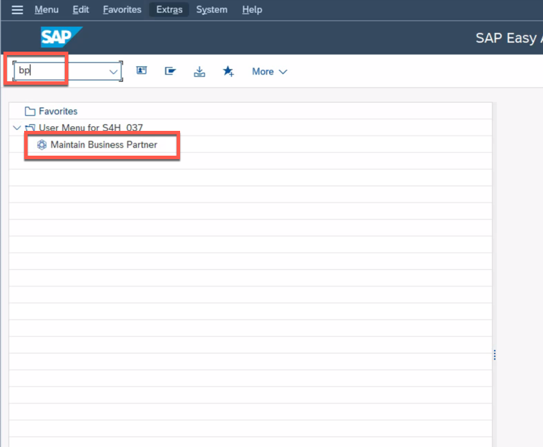

# Getting Started

Before you start work on the existing extension application, let's make sure you have all of the tools you need to complete this session successfully. This exercise will give you a few login credentials that you will need to remember throughout the session. **Please do not use any other user than the one assigned to you.**

There are only two users that you need in the entire session. Both of them are provided by SAP, please do not use your personal users for the subsequent exercises.

## Test SAP S/4HANA access

The _source system_ so to speak for our extension application is an SAP S/4HANA on-premise system. You will mostly work in the transaction **BP** to create/modify business partners which will trigger events for SAP Event Mesh or to check changes to business partners that have been made using the SAP BTP extension application. This user is used for tasks that are usually done by a functional end user.

1. Log on to the SAP S/4HANA on-premise system using the SAPGUI on your Desktop. Therefore, open the SAPGUI on your Desktop. 

2. Select (TODO: Enter correct system name, systems not yet available) from the list of systems. 

3. Enter the following credentials: 

* Client: 100
* User: BPXX
* Password: BPXX

**IMPORTANT:** XXX is the UserID on your desk. In case 01 is your UserID, please use BP01 as the user for the SAP S/4HANA sytem and BP01 also as password.
(TODO: check if BP01 is possible as password)

4. Enter **bp** as the transaction code and hit **Enter** to open the transaction. Alternatively you can also you use double-click the entry in your user menu. 

## Test SAP BTP access

Of course, you will also receive a user for the SAP BTP in order to be able to access your very own existing extension application and the corresponding services of this scenario. 

1. Open the SAP BTP Cockpit: 

## Summary

Now that you have ... 
Continue to - [Exercise 1 - Exercise 1 Description](../ex1/README.md)
