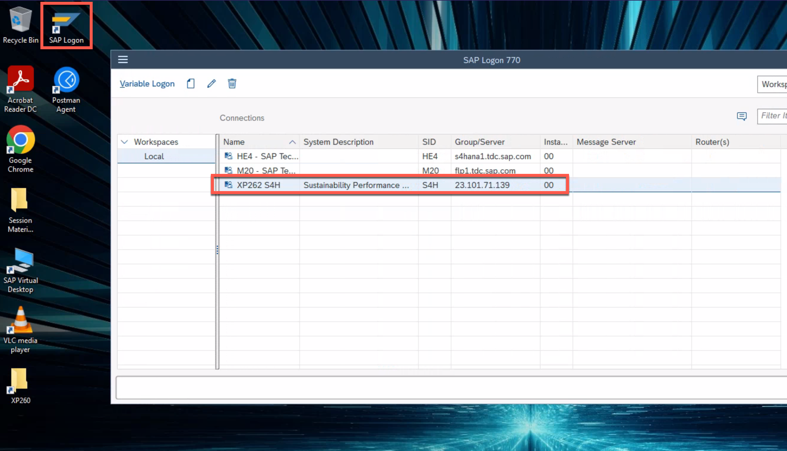
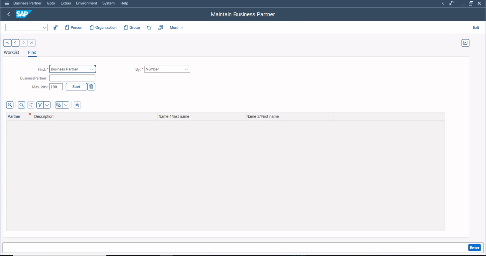

# Exercise 0 - Getting Started

Before you start work on the existing extension application, let's make sure you have all of the tools you need to complete this session successfully. This exercise will give you a few login credentials that you will need to remember throughout the session. **Please do not use any other user than the one assigned to you.**

There are only two accounts that you need in the entire session. Both of them are provided by SAP, please do not use your personal users for the subsequent exercises.

--- 
**IMPORTANT**: A so-called student number has been given to you. You will repeatedly see the placeholder **STUDENT>** throughout the entire session. Please replace this placeholder with your own student number whenever it's needed.

For instance: Student number 37 has been given to you. You receive the following task in one of the exercises: "*Please filter for BPVerification-srv-STUDENT>*."
Therefore, you would have to filter BPVerification-srv-37.

## Exercise 0.1 Test SAP S/4HANA access

The _source system_ so to speak for our extension application is an SAP S/4HANA on-premise system. You will mostly work in the transaction **BP** to create/modify business partners which will trigger events for SAP Event Mesh or to check changes to business partners that have been made using the SAP BTP extension application. This user is used for tasks that are usually done by a functional end user.

1. 👉 Log on to the SAP S/4HANA on-premise system using the SAPGUI on your Desktop. Therefore, open **SAP Logon** on your Desktop. 

2. 👉 Select the system with SID **S4H** from the list of available systems. 

    

3. 👉 Enter the following credentials: 

* Client: 100
* User: S4H_0\<STUDENT> (**IMPORTANT:** \<STUDENT> is the student number on your desk. In case you have received *01*, please use S4H_001 as the user for the SAP S/4HANA sytem. **Remember that there are three digits after the *S4H_* even though your student number doesn't have 3 digits - please use leading zeros, for instance S4H_001**.
* Password: LasVegas22!

4. 👉 Enter **bp** as the transaction code and hit **Enter** to open the transaction. Alternatively you can also double-click the entry in your user menu. 

    
    
    You will see the transaction to maintain business partners: 
    

## Exercise 0.2 Test SAP BTP access

Of course, you will also receive a user for SAP Business Technology Platform in order to be able to access your very own existing extension application and the corresponding services of this scenario. 

1. There are a few tool options that we have in order to walk you through this session and the takeways that we want to tackle. It could either be the Cloud Foundry CLI/SAPBTP CLI(either on the machines commandline/terminal or SAP Business Application Studio) or the SAP BTP Cockpit. We try to keep tools/and the potential hurdles at a minimum level in order to focus on the key aspects - understanding and getting in touch with the architecture - of the extension application. That's why we are going to use the SAP BTP Cockpit throughout this session.

    👉 Open the SAP BTP Cockpit: <https://cockpit.eu10.hana.ondemand.com/cockpit/?idp=tdcteched1.accounts.ondemand.com#/globalaccount/fb7dfea1-5d8c-431d-bd16-1ebbe842f62f/subaccount/145b0547-19d3-4d89-9b81-e55ed8d5f1db>

    👉 Enter your SAP BTP account credentials: 

* User: XP262_0XX (**Remember that there are three digits after *XP262_* even though your student number doesn't have 3 digits - please use leading zeros, for instance XP262_001**)
* Password: ask your instructor if not yet provided

    

2. This page will be needed throughout this whole session and we'll further on reference this page as **SAP BTP subaccount overview**. 

    👉 Bookmark this page as in your browser so you can easily come back later on.

3. Let's have a look at a few menu items to proof that you have all the required RoleCollections. 

    👉 Go to **Services > Instances & Subscriptions**. You should see a list with service instances and subscriptions that your SAP TechEd instructors have been created before. If you have issues seing this list, please reach out to one of the instructors. 

    

    You should now be able to see the list of already created service instances and subscriptions in this subaccount: 

    

4. 👉 Go back to the **Overview** menu where you'll find lots of information about the subaccount itself. Among other things, there is a list of Cloud Foundry spaces inside, you should see a **dev** space there. 

    

    👉 Navigate directly to the Cloud Foundry space by clicking on **dev**. 

    Here, for example, you get an overview of the applications that have been deployed in this Cloud Foundry space. There is an application for each participant that is only intended for the respective participant. Each app has its own front end with its own URL (SAP Fiori Elements application), its own backend (CAP application) and its own HDI container in SAP HANA Cloud. The only thing you share with all participants is the SAP S/4HANA system, even if you have been given your very own user for it. But more about that later. 
## Summary

Now that you have tested both required accounts, you should be well equipped to see the extension application in action. In the next step, you'll get to know the SAP BTP artefacts that your insctructors have already deployed for each student. 
Continue to - [Exercise 1 - Exercise 1](../ex1/README.md)
