# Exercise 1 - Get to know your personal artefacts 

You will work with an existing extension application to a process in a SAP S/4HANA system as part of this session to better understand the concepts behind it and be prepared for more advanced scenarios.

Before we set out to understand the actual logic behind the extension app on SAP BTP, you will first get to know your artefacts that are meant only for you. Each participant has the following artefacts in this session, which are only meant for them: 

- A custom SAP Fiori application (frontend application) in the HTML5 application repository.
- A Node.js application built with the help of SAP Cloud Application programming (CAP) model (backend application)
- A separate HDI container that stores only the data processed by the corresponding frontend and backend.
- A separate SAP Event Mesh Queue, which ensures that each participant receives dedicated events from the SAP S/4HANA on-premise system. 

Those artefacts have your personal student number in the service/application name in it.

Now over to the fictional business scenario: John who is an employee of Business Partner Validation Firm iCredible, which is a third-party vendor of ACME Corporation would like to get notifications whenever Business Partners are created/updated in the SAP S/4HANA backend system of ACME Corporation. John would then be able to review the Business Partner details in his extension app on the SAP Business Technology Platform. He would proceed to visit the Business Partner’s registered office and do some background verification. John would then proceed to update/validate the verification details into the extension app

The high level architecture is as follows: 
    

> Some components (such as Autoscaler Service, SAP Alert Notification service, Continous Integration & Delivery /CD, SAP Cloud Transport Management service) have not been implemented in the system for the sake of simplicity for this session, but exist in this case only on the architecture depiction. 

## Exercise 1.1 Open the SAP Fiori application 

1. The SAP Fiori application has already been deployed to the SAP HTML5 Application Repository for SAP BTP and is connected to your specific CAP application. 

    👉 Return to the SAP BTP subaccount overview (which you should have bookmarked in the previous exercise) and select **HTML5 Applications**.
    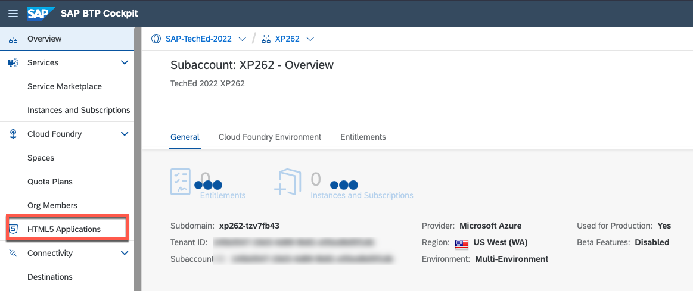

2. 👉 Click on the application with your student number. 
   
    > e.g.: If your student number is 01, please select techedbusinesspartners1. 
    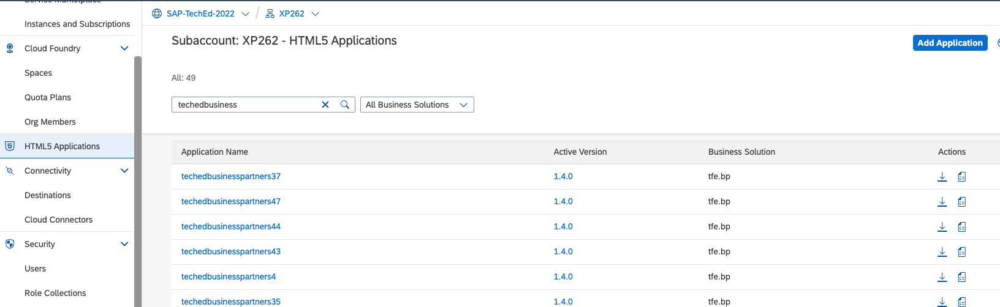 

3. A new browser tab will open, displaying a tile on a SAP Fiori Launchpad with a SAP Fiori application. This application displays data from your HDI Container on SAP HANA Cloud, as served by your own CAP application.
   
    👉 Select the tile to open the SAP Fiori application. 
    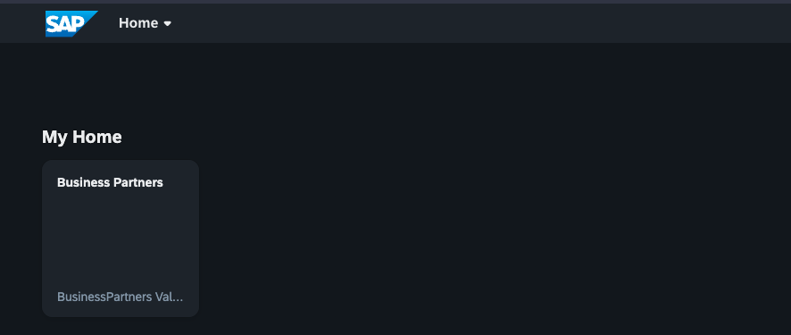 

4. A list of Business Partners appears. Those Business Partners are all coming from your HDI Container on SAP HANA Cloud. Those records have either been loaded via sample files or have been processed as a result of an event using SAP Event Mesh.
   
    👉 Bookmark this application as **BP Verification Frontend**, so you can easily access it later.
    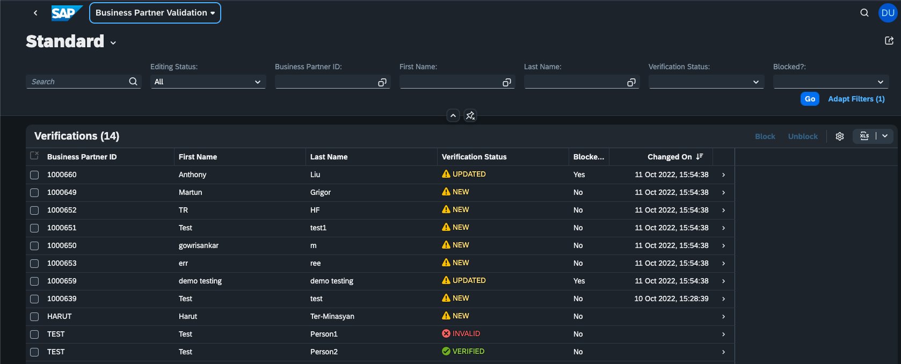 

## Exercise 1.2 Explore the CAP backend application on SAP BTP

The connecting piece between SAP S/4HANA (via SAP Cloud Connector and SAP Event Mesh), SAP HANA Cloud and the SAP Fiori application is the Node.js backend application built with the SAP Cloud Application Programming Model (CAP). You also have your own deployed instance. 

1. 👉 Go to the **SAP BTP subaccount overview** and open the **dev** (Cloud Foundry) space. 
    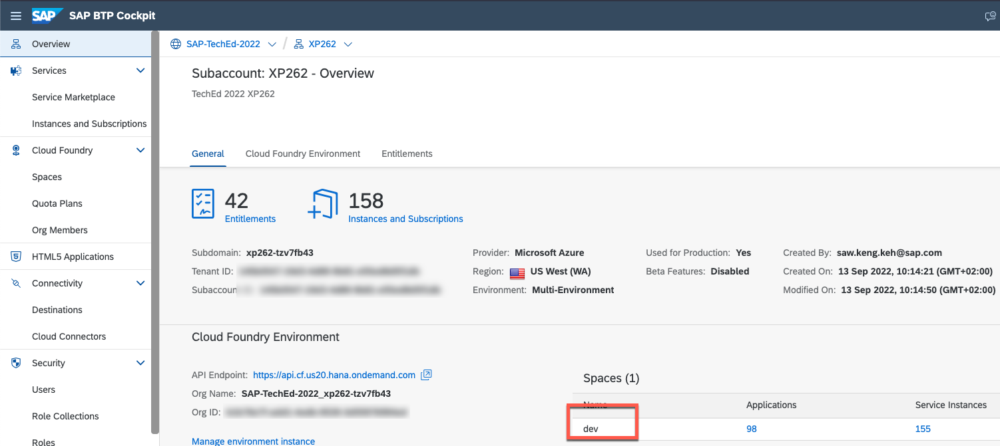 

2. You will get a list of deployed applications (either started or stopped) in this particular Cloud Foundry space. Those are: 

   - BPVerification-db-\<STUDENT>-deployer: An application that has been started once to deploy database artefacts to an HDI Container on SAP HANA Cloud.
   - BPVerification-srv-\<STUDENT>: The CAP backend application. 

    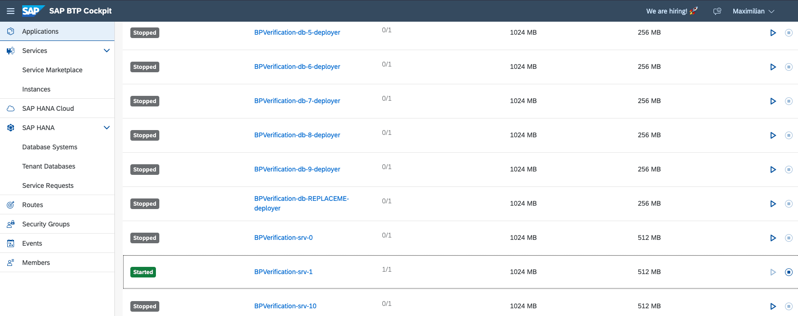 

    👉 Search for the BPVerification-srv-\<STUDENT> app **that fits to your student number** and click on it to open the details. 
    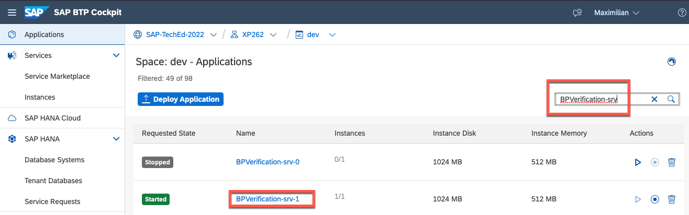 
    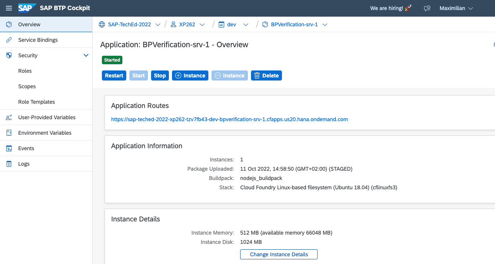 

3. This overview gives you details about the application itself (how much disk space, memory), the ability to stop/start/restart/delete the application as well as some auditing/logging menus. 

    👉 Click on the **Application Route** to open the application. 
    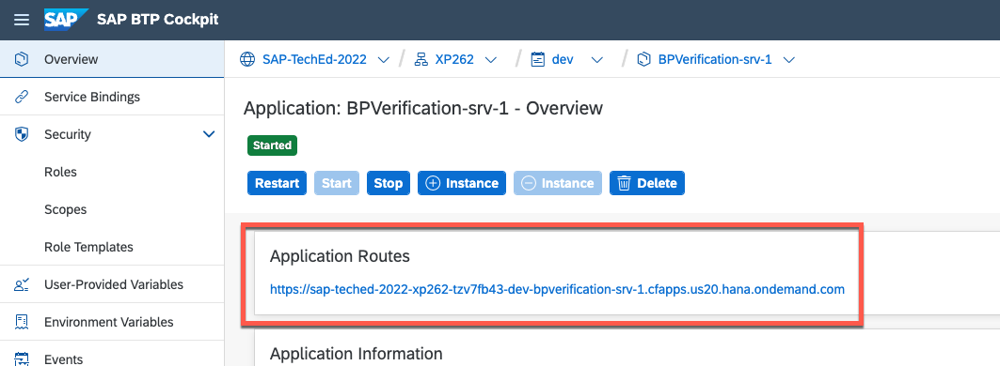 
    
    This is a CAP default landing page that lists the application's endpoints; these endpoints are also used by the SAP Fiori application. All endpoints are secure, and you are not currently authenticated, so you are not authorized to read data. 
    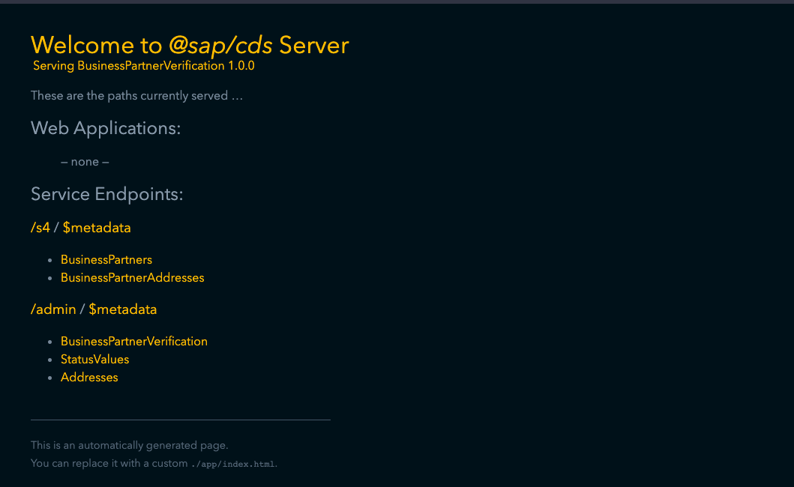 

4. 👉 Back in the application overview in the Cloud Foundry space, navigate to **Service Bindings**. 
   
    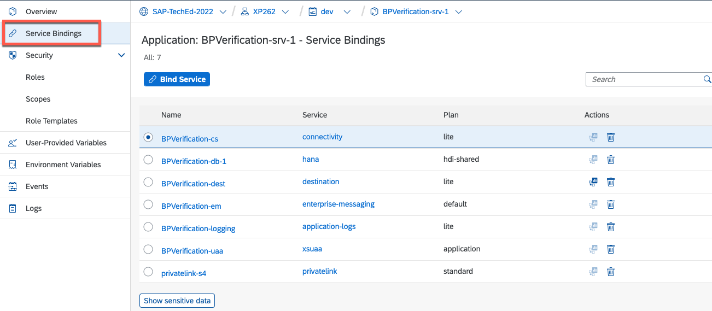 

    Short explanation: 
    - **BPVerification-dest**: service instance (SAP Destination service) to resolve destination names into the technical details (*shared with all other participants*)
    - **BPVerification-cs**: service instance (SAP Connectivity Service), additionally to the SAP Destination service, to reach endpoints connected via SAP Cloud Connector (*shared with all other participants*)
    - **BPVerification-db\<STUDENT>**: service instance (HDI Container&Schemas) to access your particular HDI Container on SAP HANA Cloud. (*not shared with all other particpants, student specific*)
    - **BPVerification-em**: service instance (SAP Event Mesh) to access SAP Event Mesh topics fed by SAP S/4HANA. (*shared with all other participants, each participant will automatically get an own queue -> next exercise*)
    - **BPVerification-uaa**: service instance (SAP Authorization and Trust Management service) to secure applications. (*shared with all other participants*)
    - **BPVerification-logging**: service instance (SAP Application Logging service for SAP BTP) to enable logging&monitoring with the help of the ELK stack. (*shared with all other participants*)
    - **privatelink-s4**: service instance (SAP Private Link service) to connect to the SAP S/4HANA system on Microsoft Azure without SAP Cloud Connector but through private network connectivity. (*shared with all other participants*)

    As you can see, each student will have it's own data storage, since every application has it's own HDI Container. 

5. For the next exercise, we will need the application ID of the deployed CAP application. (Spoiler: This is the unique identifier for your own SAP Event Mesh queue)

    👉 Go to **Environment Variables** and scroll down to the very end of **System provided** variables. 
    👉 Note down the application ID (or the first 4 digits) of the the variable **application_id**.

    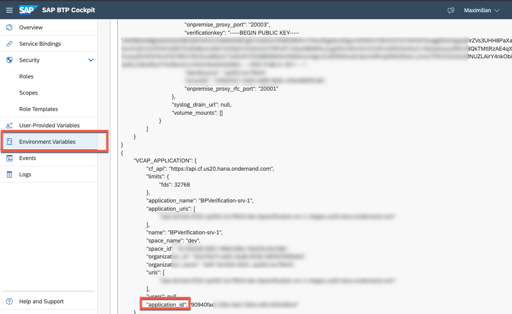 

6. As a last step, let's stop the application so that we can follow along how the application processes events via SAP Event Mesh slowly. 

    👉 Navigate to the **Overview** section of the application and **stop** the application. 

    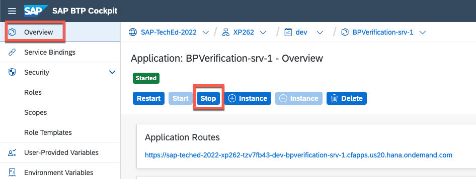 

7. 👉 To see how the frontend is connected with the backend, let's go bock to the **SAP BTP subaccount overview**. 

8. 👉 Go to **Instances and subscriptions**. Select the service instance **BPVerification-destination-service-\<STUDENT>**. A new tab will open with the details of this service instance. 
   
    This service instance is bound to the HTML5 Application repository instance for each frontend application and is used to provide URL endpoints.
    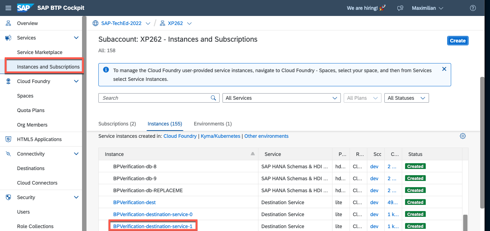 

9.  👉 Navigate to **Destinations** and select the Destination **BPVerification-srv-api-\<STUDENT>**. 

    - The URL is the URL of the CAP application that you have seen and accessed earlier in this exercise (where all the endpoints were secured and not accessible)
    - Authentication **NoAuthentication** would still mean that the application endpoints of the CAP application cannot be accessed. Since the SAP Fiori application is secured by the [Authorization and Trust Management Service (also known as xsuaa)](https://github.com/SAP-samples/btp-build-resilient-apps/blob/extension/app/businesspartners/xs-app.json) with the help of [a NPM package called approuter](https://www.npmjs.com/package/@sap/approuter), the Destination property **HTML5.ForwardAuthToken** will forward the acquired token to the backend. 

    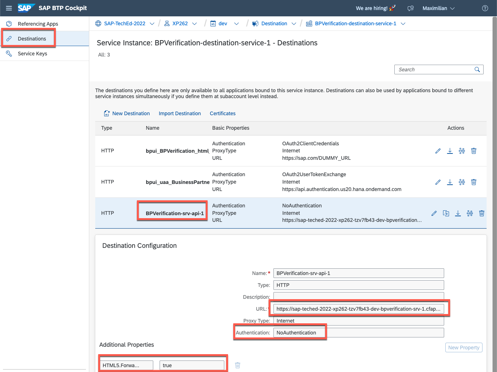 

## Summary

Nice! Now that you roughly know how the frontend (SAP Fiori application) and the backend (CAP Node.js app and SAP HANA Cloud) is connected, let's dig a little deeper. In the next exercise, you'll see how SAP Event Mesh connects SAP S/4HANA and SAP BTP and see the application itself in action.  

Continue to - [Exercise 2](../ex2/README.md)

    

