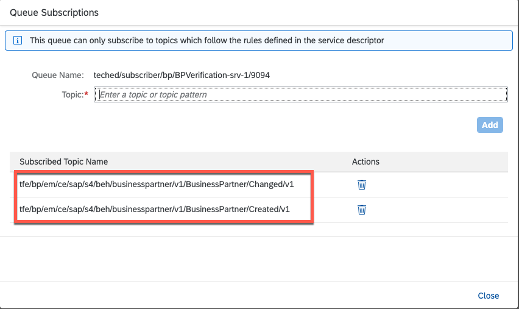

# Exercise 2 - Explore SAP Event Mesh in action 

In many cases, typical extension applications for an LoB system are based on event-driven architectures. An event-driven architecture, which is popular in modern applications built with microservices, uses events to trigger and communicate across decoupled services. An event is a status change or an update, such as a newly created or updated Business Partner. 

Event-Driven architectures usually consist of three components: 

- **An event producer:** In this case the SAP S/4HANA system 
- **An event broker:** In this case the SAP Event Mesh service on SAP BTP
- **An event consumer:** The CAP (SAP Cloud Application Programming Model) Node.js application deployed to SAP BTP, Cloud Foundry runtime

[Learn more about the general messaging concepts of SAP Event Mesh on developers.sap.com](https://developers.sap.com/tutorials/cp-enterprisemessaging-learn-messaging-concepts.html)

## Exercise 2.1 Get to know the SAP Event Mesh management dashboard

SAP Event Mesh is a fully managed service on SAP BTP and offers a management dashboard out of the box. This gives you the opportunity to interact with Queues, Subscriptions and many more artifacts via the UI as an alternative to the [REST APIs for SAP Event Mesh](https://api.sap.com/package/SAPEventMeshDefaultPlan/rest).

👉 Go back to your SAP BTP subaccount overview (you should have bookmarked this page in the previous exercise).
👉 Navigate to **Instances and Subscriptions** and open the SAP Event Mesh management dashboard via the link next to the Subscription name. 


## Exercise 2.2 Check out the queues in the SAP Event Mesh management dashboard

1. Each student's CAP applications has already been deployed by SAP TechEd instructors. CAP checks whether queues are required during application startup and, if so, whether they have already been created and connected to the application. In the service definition, for example, the [CDS declarations state that a subscription to the topic](https://github.com/SAP-samples/btp-build-resilient-apps/blob/extension/srv/external-catalog.cds) *tfe/bpem/em/ce/sap/s4/beh/businesspartner/v1/BusinessPartner/Created/v1* and *tfe/bpem/em/ce/sap/s4/beh/businesspartner/v1/BusinessPartner/Changed/v1* is required. If the Queue has not yet been created, CAP creates it with a combination of the application name and the application_id (that you noted down in the previous exercise) in its name. 

    👉 Navigate to **Message Clients**. 
    👉 Select the **subscriber** message client. (a message client = a service instance of SAP Event Mesh)
    👉 Go to the **Queue** and filter for your application_id (Environment Variable of the CAP application) that you have identified in the previous exercise. 

    

    There should only be one queue listed now. This queue is linked to your CAP application and receives events from SAP S/4HANA - regardless of whether the other applications have processed those events or not, because all other applications have their own queue and only consume events from their own queue. Your queue should be empty because all business partners changes should have been processed by your CAP application. 

2. All queues are subscribed to a certain Topic. Topics are named logical channels to which messages are published. Subscribers in a topic-based system receive all messages published to the topics to which they have subscribed. All subscribers to a topic receive their own copy of the same message. 

    👉 Select the **Actions** icon in the row of your queue (on the very right) and open **Queue subscriptions**.
        

    👉 You will see that your Queue is subscribed to the Topics that have been defined in the [CAP application](https://github.com/SAP-samples/btp-build-resilient-apps/blob/extension/srv/external-catalog.cds). 
        

    > If you want to know more about how you can configure SAP S/4HANA to push events to certain topics, have a look at the corresponding tutorial: [Configure event based communication between SAP S/4HANA and SAP Event Mesh](https://github.com/SAP-samples/btp-build-resilient-apps/tree/extension/tutorials/07-SetupEventMesh)

3. 👉 You will need the overview of your Queue further on: Leave this browser window or tab open, so you can observe in parallel how SAP Event Mesh behaves on certain actions you execute. (Bookmarking is also an option) 

## Exercise 2.3 Create a new business partner in SAP S/4HANA using the SAP GUI

Now that you know roughly what your application looks like and how the individual artifacts are connected, it's time to see it all in action by creating a new business partner in the SAP S/4HANA system. 

1. 👉 Open **SAP Logon** on your Desktop.
2. 👉 Logon with the credentials that you have used already: 
   * Client: 100
   * User: S4H_0\<STUDENT> (**IMPORTANT:** \<STUDENT> is the student number on your desk. In case you have received *01*, please use S4H_001 as the user for the SAP S/4HANA sytem.)
   * Password: LasVegas22!
3. 👉 Open the menu item **Maintain Business Partner** or enter the transaction code **bp**. 
4. 👉 Create a new **Person**. 
5. 👉 Provide the following attributes:
   - First name: Student
   - Last name: \<STUDENT> (**Makes it easier to identify your specific business partner**)
   - Street
   - House number
   - Postal Code
   - City
   - Country

6. 👉 **Save** the business partner to finish the creation (and implicitly trigger the message via SAP Event Mesh). 
   
    

## Exercise 2.4 Observe the event consumption in SAP BTP Cockpit and SAP Event Mesh management dashboard

The business partner has now been created in the SAP S/4HANA system. Asynchronously, the system has pushed an event to the SAP Event Mesh topic. All Queues subscribed to *tfe/bpem/em/ce/sap/s4/beh/businesspartner/v1/BusinessPartner/Created/v1* will receive a message with the ID of the business partner you have recently created. 

1. Let's check if the SAP Event Mesh management dashboard shows a new message.  Since your CAP application is stopped, no messages should be taken from your Queue. 

    👉 **Refresh** the status of your Queue. There should be a new message or at least one, since other attendees in the same SAP S/4HANA system have most likely also created Business Partners that are published to the same SAP Event Mesh Topic. You will get the messages as well, since all Queues are subscribed to the same Topic.
        


2. Let's see what the message contains to better understand how the extension application processes the message. 

    👉 Navigate to **Test** in the side menu. Open your particular queue in the **Consume Messages section** (filter for **srv-\<STUDENT>/** or your application_id). 

    You should get the same information about your Queue as you had in the recent view.

3. 👉 Hit **Consume Message** to take the first message that has been sent from the Queue. (*Consuming* means that this message is permanently removed from the Queue.)
    


This is the message:

```json
{"type":"sap.s4.beh.businesspartner.v1.BusinessPartner.Created.v1","specversion":"1.0","source":"tfe/bp/em","id":"YEW9iQHNHu2S3sv2ubtlkQ==","time":"2022-10-13T12:55:54Z","datacontenttype":"application/json","data":{"BusinessPartner":"1000681"}}
```
> The format of the events follows the [CloudEvents specification](https://github.com/cloudevents/spec)

You should see the header (everything except the *data* properties) and payload (the *data* property) of the message. It's not necessarily containing your business partner, since the consumption of messages is following the [FIFO](https://en.wikipedia.org/wiki/FIFO_(computing_and_electronics)) (first in first out) principle. You have just consumed the first business partner that has been created. As you can see, the payload only contains the ID of the object that has been affected. This type of events are called **Notification Events**. The format of the events is defined as 

> *"Notification events are typically as small as possible and contain only the absolutely required information. The idea behind this type of event is that consumers are informed of a change and can then decide whether they care about this change or not. If the change isn’t relevant for the consumer, the consumer ignores the event completely. If the change is relevant for the consumer, the consumer will follow up by requesting additional data and executing on this data. Notification events have a number of advantages and have certain disadvantages as well:*
>
> - *They are typically very small so a lot of notifications can be sent.* 
>
> - *They contain only the absolutely required data so data access can be controlled in a better way.*
>
> - *An additional step is needed when following up on an event to access all required data.*
>
> - *Depending on the number of events that are followed up on, they can be highly efficient or highly inefficient."*
>
> **Source:** Karsten Strothmann, SAP ([Questions from SAP Community Call: Discover Event-Driven Integration with SAP](https://blogs.sap.com/2022/02/25/questions-for-sap-community-call-discover-event-driven-integrations-with-sap/))

In short: 

1) The SAP CAP backend application would consume the message
2) Take the ID of the business 
3) Call the OData API for business partners of the SAP S/4HANA system (using a Destination on SAP BTP, no matter if the system is connected via SAP Cloud Connector or SAP Private Link - more about that in a subsequent exercise)
4) Process the business partner data and save it in the HDI Container on SAP HANA Cloud. 

> here's the corresponding coding, in case you are interested: [GitHub](https://github.com/SAP-samples/btp-build-resilient-apps/blob/extension/srv/catalog.js#L26-L49)


## Exercise 2.5 Start your application and the event consumption 

Now that you have seen what data the CAP application will actually receive once it consumes a message, let's give the CAP application a nudge to actually do its work. The messages in the queues are waiting. 

1. Let's start your application in the SAP BTP Cockpit. 
    👉 Go to the SAP BTP subaccount overview and navigate to your space to get to the application overview. 

    

    👉 Start **YOUR** application using the action icon. 

    

    👉 Wait a few seconds (or come back after you have done the next step) to check if the application was succesfully started.

2. Check the SAP Fiori frontend to see if new business partners (incl. business partners of other students) have been processed and are listed in the application.
   
    👉 Go to the SAP BTP subaccount overview and open the corresponding application (techedbusinessparters\<STUDENT>) in the HTML5 Application Repository. 
    

    👉 Open the only SAP Fiori tile to see the list of business partners that have been processed in your application. That means, the CAP application has picked up the messages in the Queue. (the Queue is only connected to your application but every application has it's own Queue, so all applications received all messages) Before the business partner data is persisted in SAP HANA Cloud, the CAP application calls the OData APIs for each business partner to retrieve the corresponding attributes. Calling the OData APIs is required since the message through SAP Event Mesh only contains the ID of the created/changed business partner and not the entire payload - that's the concept of **Notification Events**.

3. You should now create another business partner in the SAP S/4HANA system to see that this business partner will immediately appear in the SAP Fiori application (after a refresh). 
   
    👉 Go back to the SAP GUI and create another business partner (don't forget to provide your student number as Last Name and also enter the address information). **Save** the business partner to fire the event for SAP Event Mesh. 
    

    👉 Refresh the SAP Fiori application on SAP BTP to see the recently created business partner.
    

> If you are interested in the coding that processes the message from SAP Event Mesh: [GitHub](https://github.com/SAP-samples/btp-build-resilient-apps/blob/extension/srv/catalog.js#L24-L46)


4. Let's now change the address of one of your business partners in the SAP Fiori application and/or block the business partner.
    👉 Select a business partner to navigate to the details page. Go into the **Edit** mode and change the address to whatever you want, set the business partner to **Verified** and hit **Save** (lower right edge of the page).

    

    👉 Try to also block the business partner in SAP S/4HANA.
    
    

    > here's the corresponding coding, in case you are interested: [GitHub](https://github.com/SAP-samples/btp-build-resilient-apps/blob/extension/srv/catalog.js#L26-L49)

    The changes will now be sent to the SAP S/4HANA system using your Destination (of type SAP Cloud Connector so far). The field **Verification Status** is not available in the SAP S/4HANA system and only important for our application. That's why it's only persisted in the tables of our application in the HDI Container on SAP HANA Cloud.

    > If you are interested in the coding for blocking/unblocking business partners in SAP S/4HANA [GitHub](> here's the corresponding coding, in case you are interested: [GitHub](https://github.com/SAP-samples/btp-build-resilient-apps/blob/extension/srv/catalog.js#L26-L49)
    > If you are interested in the coding for updating business partners in SAP S/4HANA: [GitHub](https://github.com/SAP-samples/btp-build-resilient-apps/blob/extension/srv/catalog.js#L51-L69)

5. Go back to the SAP S/4HANA system and check if your changes were successful. 
   👉 Open the known transaction for business partners (Transaction Code **BP** or the entry in your user menu), enter the Business Partner ID, select **Start** and double-click on the resulting entry to open the business partner details.
   

   👉 Compare the address that you have entered in the extension application with the displayed results in the SAP S/4HANA system.

   👉 Go to the **Status** tab and see if blocking the business partner was also succesful. 

   (If it hasn't been updated: don't blame SAP's products and tools, your instructors just aren't the best coders 😉 - feel free to submit a bug fix via a Pull Request)

    You might have seen the benefits of decoupling the SAP S/4HANA system and the CAP application here.

    **Resiliency**: The CAP application was down (the application was stopped by your instructors for demonstration purposes), the SAP S/4HANA system wasn't aware and doesn't have to be aware of it. Still, the processing can continue once the application is back online. 
    **Scalability**: The SAP S/4HANA system doesn't have any idea how many consumers (CAP application of consumers in this case) are connected and doesn't have to be aware of how many consumers are connected.

## Summary

You've now seen how the CAP (SAP Cloud Application Programming Model) application on SAP BTP is notified about changes on business objects in SAP S/4HANA. SAP Event Mesh enables the source system to function independently of potentially interested parties. The source system remains completely unaffected whether 50 or 100 event consumers are connected, or whether certain consumers are not online at the time. As a result, SAP Event Mesh enables the decoupling of producers and consumers.

In the following exercise, you'll get a glimpse of what goes on behind the scenes and gain confidence in using Logging and Monitoring.

Continue to - [Exercise 3](../ex3/README.md)

--- 

Further Links: 
* [SAP Event Mesh overview(discovery-center.cloud.sap)](https://discovery-center.cloud.sap/)
* [Blog Posts for SAP Event Mesh (blogs.sap.com)](https://community.sap.com/search/?ct=blog&mt=73554900100800000765&q=sap%20event%20mesh)
* [SAP Event Mesh tutorials (developers.sap.com)](https://developers.sap.com/tutorial-navigator.html?tag=software-product%3Atechnology-platform%2Fsap-business-technology-platform%2Fsap-event-mesh)
