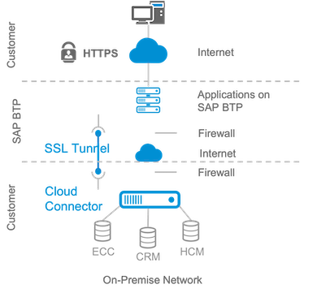

# Exercise 4 - How does SAP Cloud Connector and SAP Private Link service help?

After seeing how the application behaves on different state changes or when something goes wrong, we can now have a closer look at the connectivity topic, to learn two different approaches to establish a connection between SAP BTP and SAP S/4HANA on-premise system.

One of the following approaches may be chosen, depending on requirements:
  * Cloud Connector
  * SAP Private Link service

To better understand both options, let's have a closer look at both.

## Cloud Connector

The Cloud Connector acts as a link between on-premise systems and SAP BTP applications. By using the cloud connector, you can utilize on-premises assets without exposing your complete internal environment. Cloud Connector helps to establish a private tunnel from the cloud (SAP BTP) to the customer's on-premise network, without opening ports on the firewall. It is widely used and is also a common practice to connect to BTP from cloud-based hyperscaler systems.

The Cloud Connector should be installed on a customer's on-premise network. It supports HTTP as well as additional protocols like RFC.  

For more details please see the Cloud Connector [documentation](https://help.sap.com/docs/CP_CONNECTIVITY/cca91383641e40ffbe03bdc78f00f681/e6c7616abb5710148cfcf3e75d96d596.html?locale=en-US) 

## SAP Private Link service

SAP Private Link Service service allows to securely connect applications running on SAP BTP to workloads running on hyperscalers. This ensures that traffic is not routed through the public internet but stays within the hyperscaler infrastructure. This helps to minimize attack vectors and ensured secure communication between SAP BTP and hyperscaler workload.

Having SAP Private Link service in place will not require any more to expose the systems and communication through the internet and the whole traffic is secured by an internal hyperscaler network without any exposure.

For more details about supported hyperscalers and services please see the SAP Private Link service [documentation](https://help.sap.com/docs/PRIVATE_LINK/42acd88cb4134ba2a7d3e0e62c9fe6cf/3eb3bc7aa5db4b5da9dcdbf8ee478e52.html?locale=en-US) 

>NOTE, both options offer advantages of their own. In some scenarios it is also worth to combine the best of both worlds and have a “third configuration option”

Please take a look at the following [blog](https://blogs.sap.com/2022/07/07/btp-private-linky-swear-with-azure-running-cloud-connector-and-sap-private-link-side-by-side/) post if you are interested in comparing the two approaches.

## Exercise 4.1 SAP Cloud Connector
    Check the connectivity and application log

## Exercise 4.2 SAP Private Link service
    Check the connectivity and application log

## Summary

You should now have a good overview of how the extension application is notified about new or changed business partners using SAP Event Mesh and where the data is stored. 

Next, you are going to have a look at the logs that your application produces and set some of the outputs in context. 

