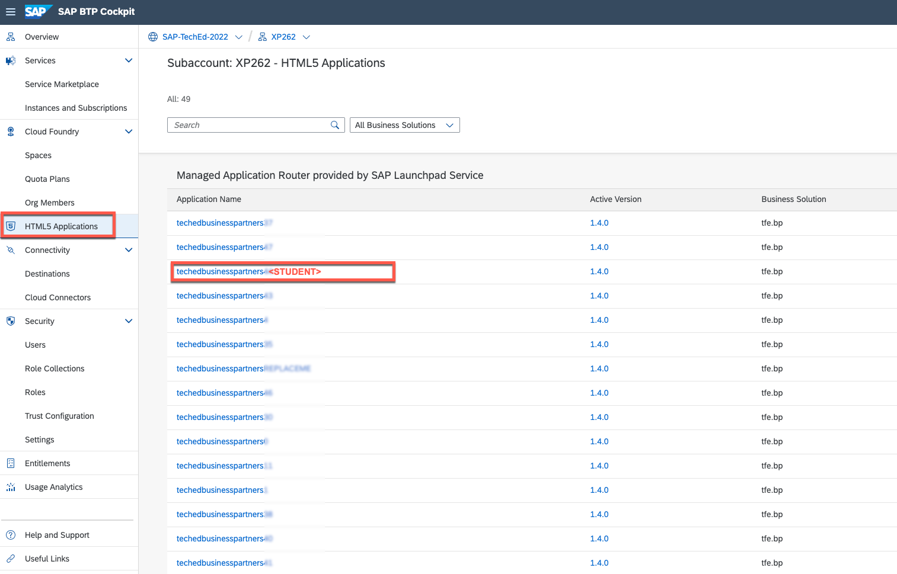
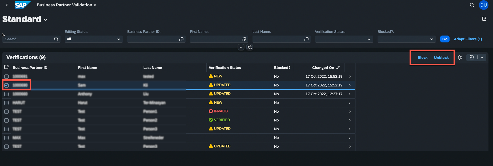
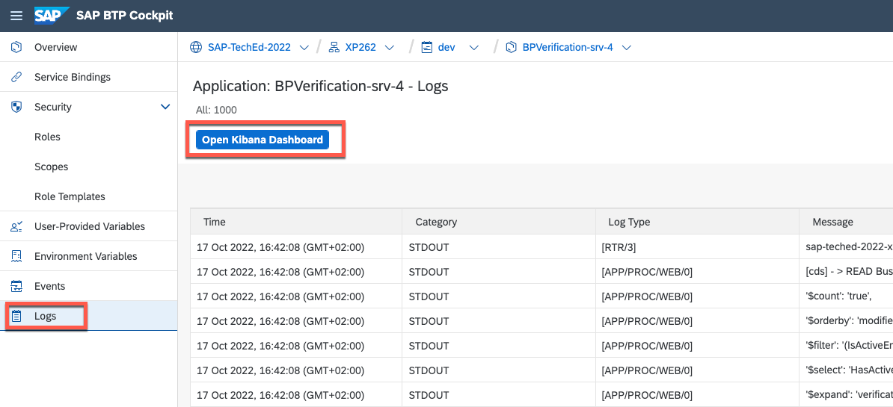
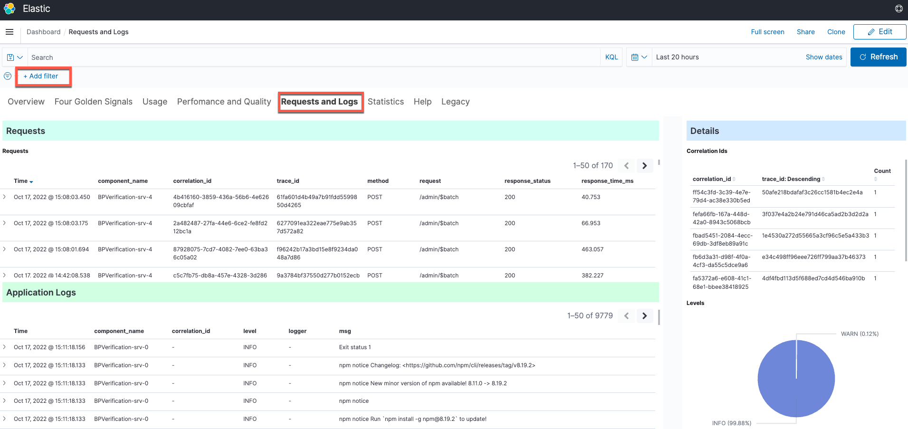
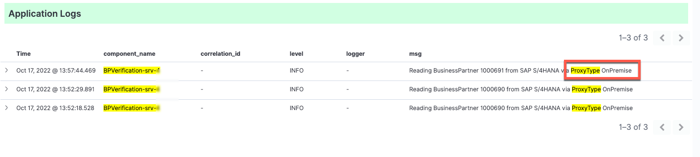

# Exercise 4 - How does SAP Cloud Connector and SAP Private Link service help?

After seeing how the application behaves on different state changes or when something goes wrong, we can now have a closer look at the connectivity topic, to learn two different approaches to establish a connection between SAP BTP and SAP S/4HANA on-premise system.

One of the following approaches may be chosen, depending on requirements:
  * Cloud Connector
  * SAP Private Link service

To better understand both options, let's have a closer look at both.

## Cloud Connector

The Cloud Connector acts as a link between on-premise systems and SAP BTP applications. By using the cloud connector, you can utilize on-premises assets without exposing your complete internal environment. Cloud Connector helps to establish a private tunnel from the cloud (SAP BTP) to the customer's on-premise network, without opening ports on the firewall. It is widely used and is also a common practice to connect to BTP from cloud-based hyperscaler systems.

The Cloud Connector should be installed on a customer's on-premise network. It supports HTTP as well as additional protocols like RFC.  

For more details please see the Cloud Connector [documentation](https://help.sap.com/docs/CP_CONNECTIVITY/cca91383641e40ffbe03bdc78f00f681/e6c7616abb5710148cfcf3e75d96d596.html?locale=en-US) 

## SAP Private Link service

SAP Private Link Service service allows to securely connect applications running on SAP BTP to workloads running on hyperscalers. This ensures that traffic is not routed through the public internet but stays within the hyperscaler infrastructure. This helps to minimize attack vectors and ensured secure communication between SAP BTP and hyperscaler workload.

Having SAP Private Link service in place will not require any more to expose the systems and communication through the internet and the whole traffic is secured by an internal hyperscaler network without any exposure.

For more details about supported hyperscalers and services please see the SAP Private Link service [documentation](https://help.sap.com/docs/PRIVATE_LINK/42acd88cb4134ba2a7d3e0e62c9fe6cf/3eb3bc7aa5db4b5da9dcdbf8ee478e52.html?locale=en-US) 

>NOTE, both options offer advantages of their own. In some scenarios it is also worth to combine the best of both worlds and have a “third configuration option”

Please take a look at the following [blog](https://blogs.sap.com/2022/07/07/btp-private-linky-swear-with-azure-running-cloud-connector-and-sap-private-link-side-by-side/) post if you are interested in comparing the two approaches.

## Exercise 4.1 Connectivity with SAP Cloud Connector
By default, the application in this exercise is configured to connect via Cloud Connector. If you are interested in detailed configuration steps, you can check following [tutorial](https://developers.sap.com/tutorials/btp-app-ext-service-cloud-connector.html).
1. To make sure that the Cloud Connector is up and running you can open **Cloud Connectors** in the **Connectivity** section of **SAP BTP Cockpit**. 
   
   You will find there the exposed Back-End systems with the required Virtual hosts information. The virtual host is a mask to hide the real system hostname, which is configured in Cloud Connector. In this example, the virtual host is: *virtualhosts4:44300* 
   
   
   
   This virtual host is used for defining the so-called Destination which is part of SAP BTP connectivity service. It contains the connection details for the remote communication of an application. In this case SAP S/4HANA system.

2. Now you can navigate to **Desinations** tab in the **Connectivity** section of **SAP BTP Cockpit**. 
   
   You will find a destination called **"BusinessPartner-\<STUDENT>"** which contains the details of remote communication. The virtual host from the previous step is defined as a URL and _OnPremise_ proxy type is selected as a connectivity option.
   You can click on **"Check Connection"** to make sure that the communication to the S/4HANA system is working properly.
   
   

3. Run the application and check the connection details in Application Log.
   
   Go to **"HTML5 Applications"** and open the application with your student number. e.g. **techedbusinesspartners\<STUDENT>**

   

   To trigger an API call, select one of the business partners from the list and **block** or **unblock** it.

   

   Now you can go to the Application Logging dashboard to check the connectivity type.

   Application Logging Dashboard you can either via this [link](https://logs.cf.us20.hana.ondemand.com/app/dashboards#/view/Overview?_g=(filters:!(),refreshInterval:(pause:!t,value:0),time:(from:now-15m,to:now))&_a=(description:'(default)%20%20Overview%20and%20some%20basic%20KPIs%20regarding%20failures,%20log%20counts,%20etc.',filters:!(),fullScreenMode:!f,options:(darkTheme:!f,useMargins:!f),query:(language:kuery,query:''),timeRestore:!f,title:Overview,viewMode:view)) or by navigating to the application instance of Cloud Foundry space.

   Open the Space and search for the application with your student number **"BPVerification-srv-\<STUDENT>"** and open it.

    
    

    Over there you can fine the link to open the **Kibana Dashboard**

    

    Once you opened the application logging dashboard, open the **Requests and Logs** tab and set following filters to find the right log entry.

   | Field          | Operator | Value                           |
   |----------------|----------|---------------------------------|
   | component_name | is       | BPVerification-srv- < STUDENT > |
   | msg            | is       | ProxyType                       |

   
   

   After setting the filters you will find the latest API call and see that **ProxyType** is **OnPremise**, which means the connectivity happened via Cloud Connector.

   

## Exercise 4.2 Connectivity with SAP Private Link service
    Check the connectivity and application log
    

## Summary

You should now have a good overview of how the extension application is notified about new or changed business partners using SAP Event Mesh and where the data is stored. 

Next, you are going to have a look at the logs that your application produces and set some of the outputs in context. 

