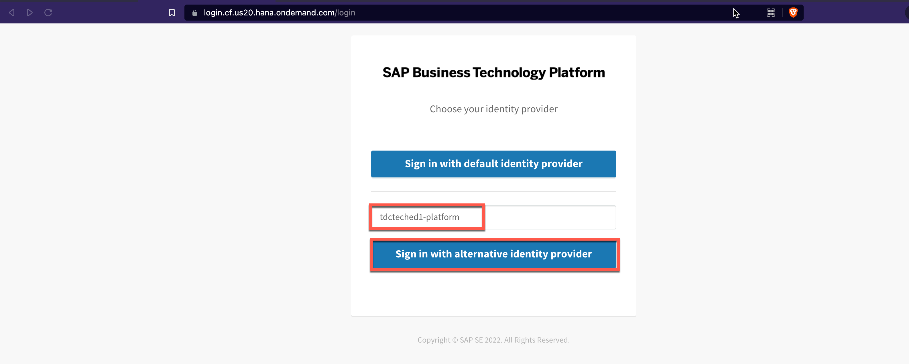
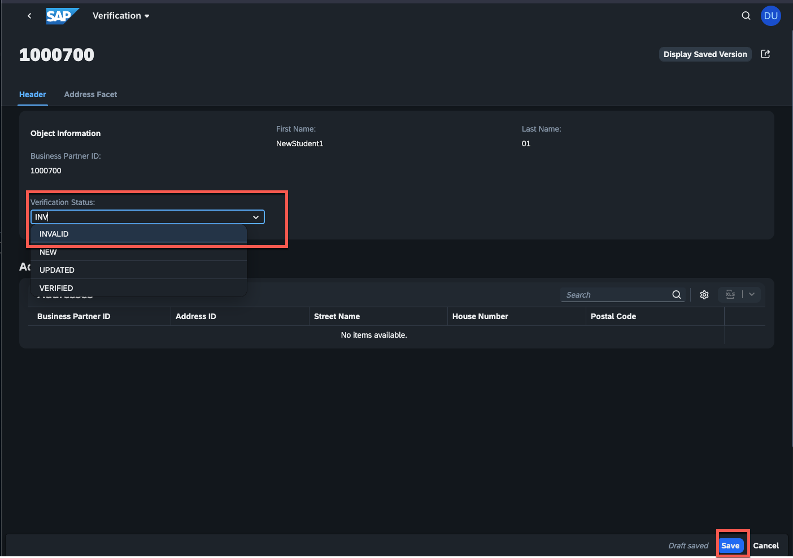
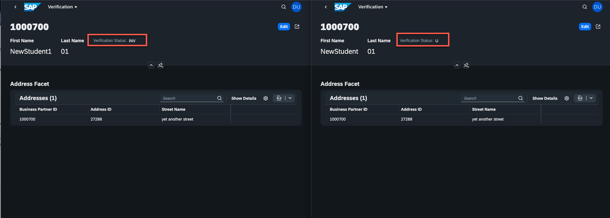

# Exercise 4 - Get in touch with your data using SAP HANA Cloud and the SAP HANA Database Explorer

Now that you've seen how the extension application is notified about new or changed business partners, and where the data eventually comes from via SAP Cloud Connector (or SAP Private Link service, next exercise), let's look at the extension application's data storage. In some cases, providing the extension application with its own data storage may make sense or even be required. It might make sense if you want to work independently of the SAP S/4HANA system, such as if the SAP S/4HANA system is down and users still need to use the applications. It is required in general if additional content (in our case, the "verification status" field) is to be stored.

Applications developed with the SAP Cloud Application Programming Model benefit from automatically generated database artefacts. These can then be deployed in a so-called HDI container in the SAP HANA Cloud. We will not go into the details of an HDI container here; more information is available at [help.sap.com](https://help.sap.com/docs/SAP_HANA_PLATFORM/3823b0f33420468ba5f1cf7f59bd6bd9/e28abca91a004683845805efc2bf967c.html?version=2.0.04&locale=en-US): 

## Exercise 4.1 What is in my HDI Container on SAP HANA Cloud?

First, you need to understand what's actually going to be deployed to your HDI Container in SAP HANA Cloud. There's two different files we are going to have a look at: 

- [/db/schema.cds](https://github.com/SAP-samples/btp-build-resilient-apps/blob/extension/db/schema.cds) file in the CAP application contains the data model.
- [/srv/catalog.cds](https://github.com/SAP-samples/btp-build-resilient-apps/blob/extension/srv/catalog.cds) file in the CAP application contains the service definition

The CAP compiler takes the CDS files and, as the tools already says, compiles it to artefacts that can be deployed to SAP HANA Cloud. Usually, to keep it simple in this case: the data model (entities) are tables actually holding data and the services are on database level Views on different entities with some logic on top. 

Some of the tables (like StatusValues) receive static values from CSV files, the other tables (Verifications, Addresses) are filled once the event handlers that you have seen in the previous exercises processed incoming events from SAP S/4HANA via SAP Event Mesh. Additionally, CAP produces additional tables for [draft handling](https://help.sap.com/docs/ABAP_PLATFORM_NEW/468a97775123488ab3345a0c48cadd8f/ed9aa41c563a44b18701529c8327db4d.html?version=202110.000&locale=en-US) based on the [corresponding annotation in the CDS files](https://github.com/SAP-samples/btp-build-resilient-apps/blob/extension/srv/catalog.cds#L7).

Since the CAP application is already deployed, you should most likely see those artefacts in SAP HANA Cloud already. That's what you'll do in the next steps. 

## Exercise 4.2 Open the SAP HANA Database Explorer

There's different administration tools for SAP HANA Cloud. May it be [Database Explorer feature in SAP Business Application Studio](https://blogs.sap.com/2020/12/23/sap-hana-cloud-and-sap-business-application-studio/) (that we could used as well in this session but we wanted to keep the amount of tools as low as possible) or the OpenSource [SAP HANA Developer CLI (sample coding)](https://github.com/SAP-samples/hana-developer-cli-tool-example). We'll use one of the SAP HANA Cloud capabilities called **SAP HANA Database Explorer** that you can directly access via SAP BTP Cockpit. 

1. Navigate to the SAP HANA Database Explorer. 

    👉 Go to your SAP BTP subaccount overview and open the **dev** space.
    👉 Select **SAP HANA Cloud**. Open the **Actions** dropdown of the SAP HANA Cloud instance *XP262hana* and open the **SAP HANA Database Explorer**. 
    

    **IMPORTANT**: There's a bug right now. The links in SAP BTP Cockpit (and SAP HANA Cloud Central are wrong), please open the SAP HANA Database Explorer directly using this link: <https://hana-cockpit.cfapps.us20.hana.ondemand.com/hrtt/sap/hana/cst/catalog/cockpit-index.html>

     👉 In case you will be asked for authentication, enter the following origin key (***tdcteched1-platform***) from the identity provider and sign in with alternative identity provider 

     ***Origin Key: tdcteched1-platform***

     

2. Your SAP HANA Database Explorer will look fairly empty, since you haven't connected to any database or HDI Container. 
    
    👉 Hit the **+** icon to add a new connection. 
    
    

3. 👉 Switch the **Instance Type** to **HDI Container**, choose the HDI Container with your \<STUDENT> number and proceed with **OK**.
    

    The SAP HANA Database Explorer will now connect to the HDI Container. Are you wondering why your personal user has access to this particular HDI Container? The SAP HANA Database Exploerer implicitly creates a so-called service key and uses its credentials to connect. If you are in your **dev** space and look for the HDI Container, you will see the automatically generated service key in the details view of your BPVerification-db-\<STUDENT> instance. 

## Exercise 4.3 Find the tables of the extension application

There's a not a lot of content available in your HDI Container, basically just some Views and Tables. But that's all we need right now. 

1. 👉 Double-click the tables item, so you can see which tables have been created. You will see some of the tables that have been compiled and then deployed to the HDI Container.
    

    - **TFE_MODEL_BPVERIFICATION_ADDRESSES**: One of the entities defined in the data model of the CAP application. (concatenated with the namespace that is defined in the first line of the CDS file)
    - **TFE_MODEL_BPVERIFICATION_STATUSVALUES**: One of the entities defined in the data model of the CAP application. (concatenated with the namespace that is defined in the first line of the CDS file)
    - **TFE_MODEL_BPVERIFICATION_VERIFICATIONS**: One of the entities defined in the data model of the CAP application. (concatenated with the namespace that is defined in the first line of the CDS file)
    - **DRAFT_DRAFTADMINISTRATIVEDATE**: General table once one entity is annotated with *@odata.draft.enabled* (Draft-Handling).
    - **TFE_SERVICE_BUSINESSPARTNERVALIDATION_ADMINSERVICE_BUSINESSPARTNERVERIFICATION_DRAFTS**: Automatically generated table for Draft-Handling (naming: namespace + service name + entity + _DRAFTS)
    - **TFE_SERVICE_BUSINESSPARTNERVALIDATION_ADMINSERVICE_ADDRESSES_DRAFTS**: Automatically generated table for Draft-Handling, since it's part of the Composition with the parent entity (naming: namespace + service name + entity + _DRAFTS)

2. 👉 Double-click the **Views** item and make yourself familiar with the individual Views. By selecting one of the Views, the Columns information and alike will appear on the right. Basically all the entities have a corresponding View, since they are exposed via the *AdminService* (SourceCode: <https://github.com/SAP-samples/btp-build-resilient-apps/blob/extension/srv/catalog.cds#L8-L22>)
   
## Exercise 3.4 Change a business partner and check the updates in SAP S/4HANA and the HDI Container (extension field vs. S4 fields)

Now that you have access to the tables, we'll see all of the processing once again in action. 

1. 👉 Open the **TFE_MODEL_BPVERIFICATION_VERIFICATIONS** table by selecting the entry and display the available data via **Open Data**. 
    

2. 👉 Set a filter **BUSINESSPARTNERLASTNAME** to **\<STUDENT>**, so that only your created business partners are getting displayed and it's easier to keep an eye on new entries. Create the filter with **Apply**.
    
   
3. 👉 Also, open your SAP Fiori application in parallel and set the exact same filter for Last name = \<STUDENT>. Check if the data you have in your SAP HANA Cloud is identical to what you see in the SAP Fiori application. 

4. 👉 Go the SAP S/4HANA system and create yet another business partner. Make sure to provide a First Name, Last Name (**\<STUDENT>**) and an Address, similarly to the business partners you have created in the previous steps and exercises.
   
5. 👉 Refresh the table data in SAP HANA Cloud and verify if the data has been saved in SAP HANA Cloud.
    

6. 👉 Also, refresh your SAP Fiori Application to see if the recently created business partner was processed. 

7. 👉 Edit the recently created business partner and set the verifications status to **INVALID**.
    

The Verification Status field is only available in the extension application and is not part of any data model in SAP S/4HANA. All other data (such as the business partner addresses) are updated in SAP S/4HANA via the OData APIs. 

As you may remember, SAP Event Mesh delivers events whenever a new business partner is created or changed. In this respect, all other applications also receive changes to business partner addresses that you have made in your extension application since they are replicated back to SAP S/4HANA using the OData APIs. 

Because the verification status of the business partner is only stored in your HDI container, the content varies from extension application to extension application. This means, if you are updating the Verification Status for Business Partner 1000700 in your application, the changes won't show up in SAP HANA Cloud of any other student. In this scenario, it is only a single field (verification status) that is not available in the SAP S/4HANA system and is therefore specific to the extension use case on SAP BTP. In most cases, however, extensions are much more complex and extensive than a single field. 

8. 👉 Now that you know that the verification status is only updated in your data model: Check in the SAP Fiori application of another student whether the verification status for the business partner you adjusted in the previous step is still unchanged here. (In random cases, it is possible that the student in whose SAP Fiori application you are currently working has also adjusted the verification status of exactly the same business partner).

Below you can see a screenshot of the application of your instructor (left), on the right an application of another student: Same business partner, different values for verification status.

**IMPORTANT**: This shouldn't showcase how you can run the exact same application multiple times in parallel.  Rather, it is intended to illustrate the architecture of a possible extension application. CAP creates its own HDI container for data storage by default. . 
## Summary

You should now have a good overview of how the extension application is notified about new or changed business partners using SAP Event Mesh and where the data is stored. 

Next, you are going to have a look at one of the key elements in extension scenarios: The type of connectivity to your source system. Until now, you have used a Destination that is leveraging the SAP Cloud Connector. Since both your SAP BTP subaccount and the SAP S/4HANA system are hosted on Microsoft Azure, there's an alternative connectivity option. 

Continue to - [Exercise 5](../ex5/README.md)

