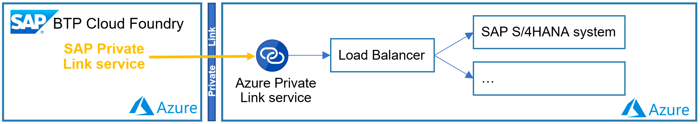
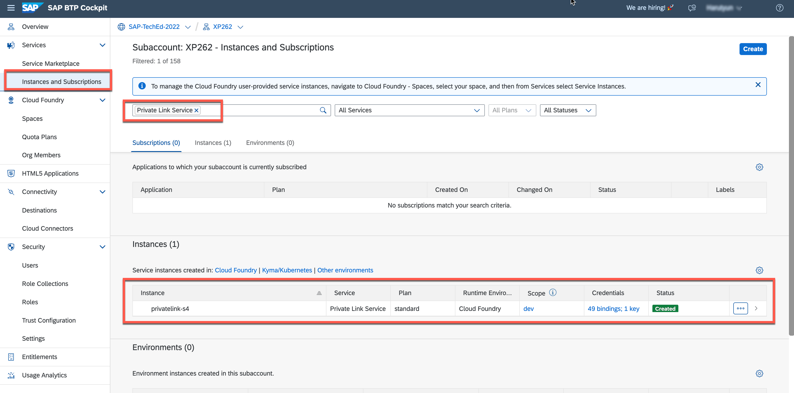
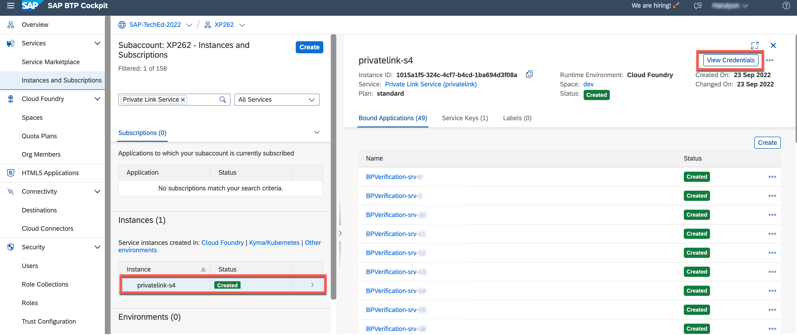
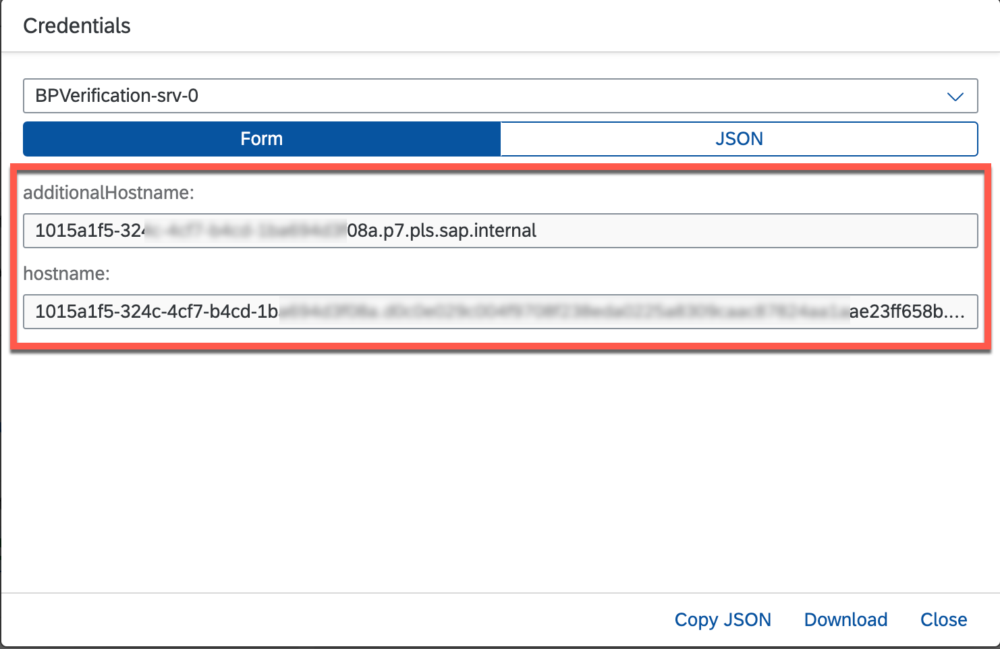
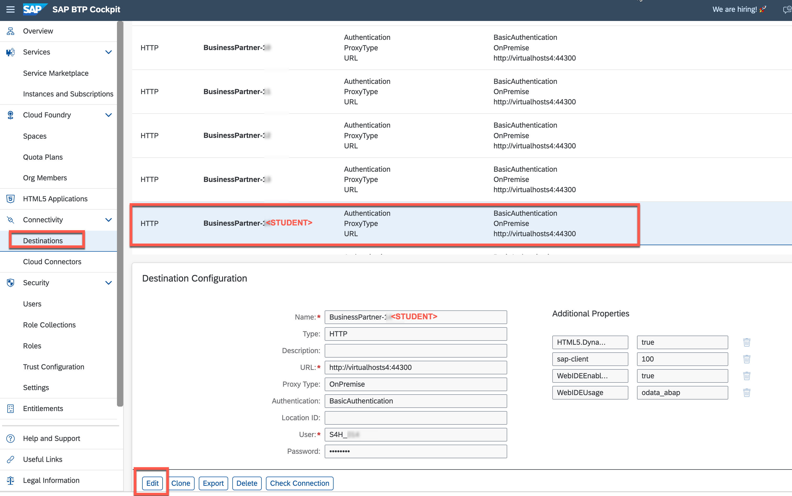
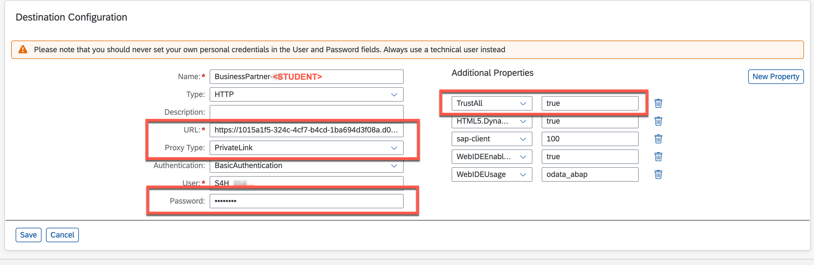
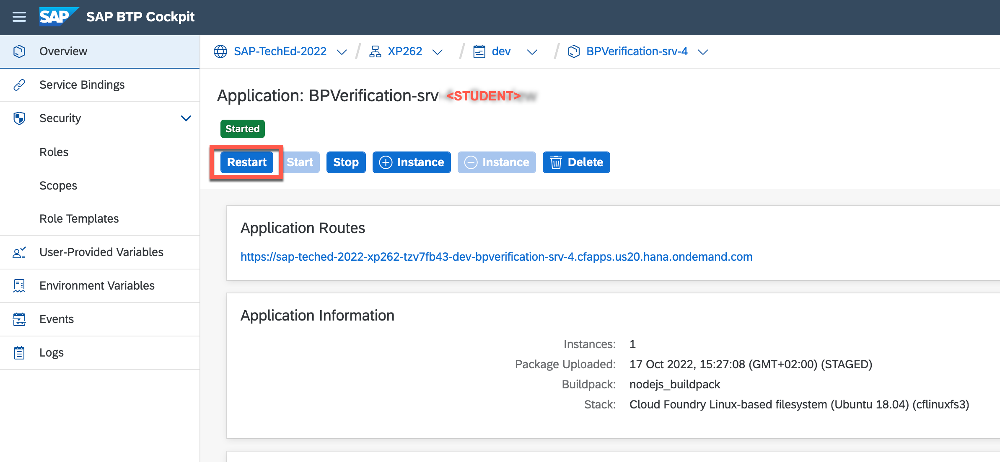
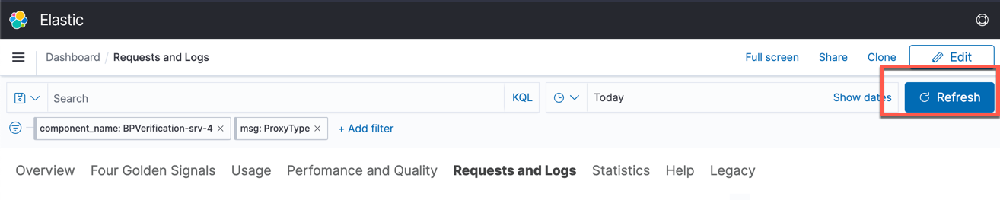
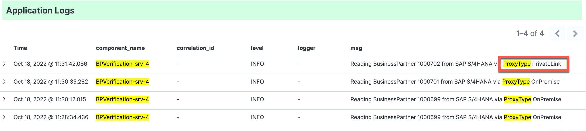

# Exercise 5 - Discover the connectivity options of SAP BTP by utilizing SAP Cloud Connector and SAP Private Link service

After observing how the application behaves on different state changes or when something goes wrong, we can now have a closer look at the connectivity topic, to learn two different approaches to establish a connection between SAP BTP and the SAP S/4HANA on-premise system.

One of the following approaches may be chosen, depending on requirements:
  * SAP Cloud Connector
  * SAP Private Link service

To better understand both options, let's have a closer look at both.

## SAP Cloud Connector

The SAP Cloud Connector acts as a link between on-premise systems and SAP BTP applications. By using the SAP Cloud Connector, you can utilize on-premises assets without exposing your complete internal environment. SAP Cloud Connector helps to establish a private tunnel from the cloud (SAP BTP) to the customer's on-premise network, without opening ports on the firewall. It is widely used and is also a common practice to connect to SAP BTP from cloud-based hyperscaler systems.

The SAP Cloud Connector should be installed on a customer's on-premise network. It supports HTTP as well as additional protocols like RFC.  

 

For more details please see the SAP Cloud Connector [documentation](https://help.sap.com/docs/CP_CONNECTIVITY/cca91383641e40ffbe03bdc78f00f681/e6c7616abb5710148cfcf3e75d96d596.html?locale=en-US) 

## SAP Private Link service

SAP Private Link Service service allows to securely connect applications running on SAP BTP to workloads running on hyperscalers. This ensures that traffic is not routed through the public internet but stays within the hyperscaler infrastructure. This helps to minimize attack vectors and ensured secure communication between SAP BTP and hyperscaler workload.

Having SAP Private Link service in place will not require any more to expose the systems and communication through the internet and the whole traffic is secured by an internal hyperscaler network without any exposure.

For more details about supported hyperscalers and services please see the SAP Private Link service [documentation](https://help.sap.com/docs/PRIVATE_LINK/42acd88cb4134ba2a7d3e0e62c9fe6cf/3eb3bc7aa5db4b5da9dcdbf8ee478e52.html?locale=en-US) 

>NOTE, both options offer advantages of their own. In some scenarios it is also worth to combine the best of both worlds and have a “third configuration option”

Please take a look at the following [blog post](https://blogs.sap.com/2022/07/07/btp-private-linky-swear-with-azure-running-cloud-connector-and-sap-private-link-side-by-side/) if you are interested in comparing the two approaches.

## Exercise 5.1 Connectivity with SAP Cloud Connector
By default, the application in this exercise is configured to connect via SAP Cloud Connector. If you are interested in detailed configuration steps, you can check following [tutorial](https://developers.sap.com/tutorials/btp-app-ext-service-cloud-connector.html).

1. 👉 To make sure that the SAP Cloud Connector is up and running, navigate to the **SAP BTP subaccount overview** that you have bookmarked and go to the **Cloud Connectors** menu in the **Connectivity** section.
   
   There you will find the exposed Back-End systems as well as the required virtual hosts information. The virtual host is a mask that hides the actual system hostname, which is set in Cloud Connector. The virtual host in this example is: *virtualhosts4:44300* 
   
   
   
   This virtual host is used for defining the so-called Destination which is part of the SAP BTP connectivity service. It contains the connection details for the remote communication of an application, in this case the SAP S/4HANA on-premise system.

2. 👉 Navigate to the **Destinations** menu in the **Connectivity** section.  
   
   You will find a destination called **BusinessPartner-STUDENT>** that provides remote communication information. The previously defined virtual host is defined as the URL and the _OnPremise_ proxy type is chosen as a connection option. *OnPremise* indicates to the consuming Toll/Service/SDK that the specified URL must first be resolved using the Connectivity Service. The virtual host can only be resolved using the Connectivity Service and only within the SAP BTP network!  
   
   👉 Check the communication to the SAP S/4HANA system by clicking **Check Connection**.
   
   

3. Check the current connection details in the Kibana dashboard. The application coding contains log outputs to log the Destination type that is being used to connect to the SAP S/4HANA system. The OData APIs to read from SAP S/4HANA are only called whenever an event (business partner created or changed) on the corresponding SAP Event Mesh Queue comes in, so that happened already a couple of times.  

   👉 Open the **Kibana dashboard** that you have bookmarked in [exercise 03](../ex3/README.md).

   👉 Open the **Requests and Logs** tab and set the following filters to find the right log entries for your application. 

   | Field          | Operator | Value                         |
   | -------------- | -------- | ----------------------------- |
   | component_name | is       | BPVerification-srv-\<STUDENT> |
   | msg            | is       | ProxyType                     |

   
   

   After setting the filters you will find the latest API call and see that **ProxyType** is **OnPremise**, which means the connectivity happened via SAP Cloud Connector.

   

4. 👉 **Leave this browser tab open, so that you can later on simply refresh the results!**

## Exercise 5.2 Connectivity with SAP Private Link service

In this example, you are going to use the SAP Private Link service to communicate with an SAP S/4HANA system running on Microsoft Azure instead of the SAP Cloud Connector (as it is until now). The essential procedures to build the appropriate service instances have already been completed for the sake of time, simplicity, and security.

This connection can be established by creating an Azure Private Link service that exposes a load balancer that routes traffic to the SAP S/4HANA system. This Azure Private Link service must then be used as the resource to which the SAP Private Link service connects. As soon as the connection is established successfully, the SAP Private Link service provides private DNS hostnames pointing to the Azure Private Link service.

Having SAP Private Link service in place will not require any more to expose the systems and communication through the internet and the whole traffic is secured by an internal hyperscaler network without any exposure.

In this exercise, we'll switch the connectivity setting and configure the SAP Private Link service as the connection method for our destination.

If you're curious about the steps involved of this scenario in setting up a Private Link connection between SAP BTP and Microsoft Azure, you can look at the following [GitHub repository](https://github.com/SAP-samples/btp-build-resilient-apps/blob/extension-privatelink/tutorials/05-PrivateLink/README.md). 

1. 👉 Open the SAP BTP subaccount overview in a new browser tab.

2. 👉 Go to the **Instances and Subscriptions** section of your SAP BTP cockpit and search for **Private Link Service**.

   Your instructors have already created the service instance for SAP Private Link service.
   
   > In case you are interested, [here](https://github.com/SAP-samples/btp-build-resilient-apps/blob/extension-privatelink/tutorials/05-PrivateLink/README.md#set-up-sap-private-link-service-on-sap-btp) are the required steps. 

   

2. 👉 Select the service instance, then choose **View Credentials**. 

   

   There you can find the created list of private DNS hostnames that will be utilized in the upcoming steps for private communication.

   

   These entries can be used to set up the **Desination** and also to issue TLS certificates so that connected systems can identify themselves.

   * *hostname* - the subdomain consists of service instance id and resource hash and is more stable for creating wildcard certificates. This will allow using the same certificate for multiple private link connections to the same Azure Private Link Service.
   * *additionalHostname* - is shorter due to the domain name length limitation of some certificate providers and can be used for those cases, but keep in mind that for every new instance that you create it may change.

   > Although Private Link Service is a private tunnel, it is common to use Transport Layer Security (TLS) for security between applications. Private DNS hostname will allow issuing certificates based on an actual hostname for the connected resource and enables TLS connections with verified hostnames.

3. 👉 Copy the **hostname** to your clipboard.

4. 👉 Now, find the destination with your student number e.g. **BusinessPartner-\<STUDENT>** and open **Edit** mode.

   

5. 👉 Make the following adjustments in your destination
   
   * Paste the copied *hostname* from the SAP Private Link service instance as a new URL
   * Change **ProxyType** to **PrivateLink**
   * Add **TrustALL=true** as an Additional Property
   * Re-enter the password (*LasVegas22!*)
  
   

6. **Save** the destination.

   > Note: If TrustAll is set to TRUE in the destination, the server certificate will not be checked for SSL connections. It is intended for test scenarios only, and should not be used in production (the server certificate will not be checked and you will not notice MITM attacks).

   > If you're interested in learning more about how to set up end-to-end SSL, you can check the details in the following [repository](https://github.com/SAP-samples/btp-build-resilient-apps/blob/extension-privatelink/tutorials/05-PrivateLink/README.md#setup-end-to-end-ssl).

6. 👉 Restart the application to avoid destination caching issues. 
   Open the **dev** space and search for the application with your student number **BPVerification-srv-\<STUDENT>** and restart it.

    
    
    

7. To verify that the CAP application is now calling SAP S/4HANA OData APIs using the Private Link connection, you first need to create a new business partner. (The CAP application will react on the resulting message on SAP Event Mesh and calls the SAP S/4HANA OData APIs to receive the required data for the business partner ID as part of the received message. 

   👉 Go the SAP S/4HANA system and create another business partner. Make sure to provide a First Name, Last Name (**\<STUDENT>**) and an Address, similarly to the business partners you have created in the previous steps and exercises.

   👉 Refresh the Kibana dashboard that is (hopefully) still open in a separate browser tab.
   

   You should now see the latest API call and see that **ProxyType** is **PrivateLink** instead of **OnPremise**. 

   

8. 👉 Open your SAP Fiori application and verify that the recently created business partner (the one that you have created after you have switched the Destination type to PrivateLink) has been processed correctly. 

## Summary

Well done; with this knowledge, you should be able to establish a connection to an on-premises SAP S/4HANA system using any of the several connectivity methods provided by the SAP Business Technology Platform.

This exercise, in addition to demonstrating the new connection type "PrivateLInk," is intended to demonstrate how powerful destinations are on SAP BTP. They serve as a central repository for connection information.

In this case, each student has a destination that points to the same source system as the others. However, this is only because of the cirumstances in this hands-on session, which allows everyone to configure their own destination. Usually, central changes to connection data can be made with little effort with the help of Destinations. 

Furthermore, this exercise is intended to demonstrate that the application can access source systems via various connection types without requiring any coding changes. You only restarted the application, which is not always mandatory.

---

Further Links: 

* [What is the SAP Private Link Service? (help.sap.com)](https://help.sap.com/docs/PRIVATE_LINK/42acd88cb4134ba2a7d3e0e62c9fe6cf/3eb3bc7aa5db4b5da9dcdbf8ee478e52.html) 
* [Blog Posts for SAP Private Link Service (blogs.sap.com)](https://blogs.sap.com/tag/sap-private-link-service/)
* [Connect SAP Link Service to Microsoft Azure Private Link Service](https://developers.sap.com/mission.private-link-connect.html)

