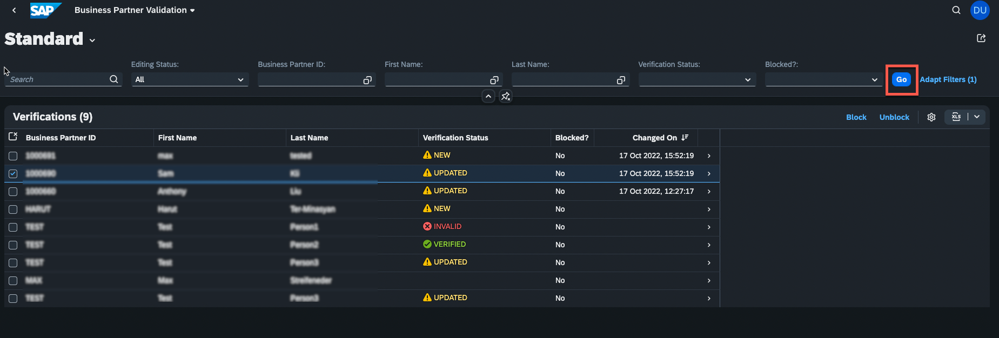

# Exercise 5 - Discover the connectivity options of SAP BTP by utilizing SAP Cloud Connector and SAP Private Link service

After observing how the application behaves on different state changes or when something goes wrong, we can now have a closer look at the connectivity topic, to learn two different approaches to establish a connection between SAP BTP and SAP S/4HANA on-premise system.

One of the following approaches may be chosen, depending on requirements:
  * Cloud Connector
  * SAP Private Link service

To better understand both options, let's have a closer look at both.

## Cloud Connector

The Cloud Connector acts as a link between on-premise systems and SAP BTP applications. By using the cloud connector, you can utilize on-premises assets without exposing your complete internal environment. Cloud Connector helps to establish a private tunnel from the cloud (SAP BTP) to the customer's on-premise network, without opening ports on the firewall. It is widely used and is also a common practice to connect to BTP from cloud-based hyperscaler systems.

The Cloud Connector should be installed on a customer's on-premise network. It supports HTTP as well as additional protocols like RFC.  

 

For more details please see the Cloud Connector [documentation](https://help.sap.com/docs/CP_CONNECTIVITY/cca91383641e40ffbe03bdc78f00f681/e6c7616abb5710148cfcf3e75d96d596.html?locale=en-US) 

## SAP Private Link service

SAP Private Link Service service allows to securely connect applications running on SAP BTP to workloads running on hyperscalers. This ensures that traffic is not routed through the public internet but stays within the hyperscaler infrastructure. This helps to minimize attack vectors and ensured secure communication between SAP BTP and hyperscaler workload.

Having SAP Private Link service in place will not require any more to expose the systems and communication through the internet and the whole traffic is secured by an internal hyperscaler network without any exposure.

For more details about supported hyperscalers and services please see the SAP Private Link service [documentation](https://help.sap.com/docs/PRIVATE_LINK/42acd88cb4134ba2a7d3e0e62c9fe6cf/3eb3bc7aa5db4b5da9dcdbf8ee478e52.html?locale=en-US) 

>NOTE, both options offer advantages of their own. In some scenarios it is also worth to combine the best of both worlds and have a “third configuration option”

Please take a look at the following [blog](https://blogs.sap.com/2022/07/07/btp-private-linky-swear-with-azure-running-cloud-connector-and-sap-private-link-side-by-side/) post if you are interested in comparing the two approaches.

## Exercise 5.1 Connectivity with SAP Cloud Connector
By default, the application in this exercise is configured to connect via Cloud Connector. If you are interested in detailed configuration steps, you can check following [tutorial](https://developers.sap.com/tutorials/btp-app-ext-service-cloud-connector.html).
1. 👉 To make sure that the Cloud Connector is up and running you can open **Cloud Connectors** in the **Connectivity** section of **SAP BTP Cockpit**. 
   
   You will find there the exposed Back-End systems with the required Virtual hosts information. The virtual host is a mask to hide the real system hostname, which is configured in Cloud Connector. In this example, the virtual host is: *virtualhosts4:44300* 
   
   
   
   This virtual host is used for defining the so-called Destination which is part of SAP BTP connectivity service. It contains the connection details for the remote communication of an application. In this case SAP S/4HANA system.

2. 👉 Now you can navigate to **Desinations** tab in the **Connectivity** section of **SAP BTP Cockpit**. 
   
   You will find a destination called **"BusinessPartner-\<STUDENT>"** which contains the details of remote communication. The virtual host from the previous step is defined as a URL and _OnPremise_ proxy type is selected as a connectivity option.
   You can click on **"Check Connection"** to make sure that the communication to the S/4HANA system is working properly.
   
   

3. Run the application and check the connection details in Application Log.

   👉 Open the SAP S/4HANA system and create a new business partner by providing the *firstname and lastname* (transaction ***/nbp***)
   
   
   
   👉 Go to **"HTML5 Applications"** in your SAP BTP cockpit and open the application with your student number. e.g. **techedbusinesspartners\<STUDENT>**

   

   👉 To trigger an API call, hit the **"GO"** button to load the newly created business partner.

   

   Now you can go to the Application Logging dashboard to check the connectivity type.

   👉 Application Logging Dashboard you can either via this [link](https://logs.cf.us20.hana.ondemand.com/app/dashboards#/view/Overview?_g=(filters:!(),refreshInterval:(pause:!t,value:0),time:(from:now-15m,to:now))&_a=(description:'(default)%20%20Overview%20and%20some%20basic%20KPIs%20regarding%20failures,%20log%20counts,%20etc.',filters:!(),fullScreenMode:!f,options:(darkTheme:!f,useMargins:!f),query:(language:kuery,query:''),timeRestore:!f,title:Overview,viewMode:view)) or by navigating to the application instance of Cloud Foundry space.

   👉 Open the Space and search for the application with your student number **"BPVerification-srv-\<STUDENT>"** and open it.

    
    

    Over there you can fine the link to open the **Kibana Dashboard**

    

   👉 In case you will be asked for authentication, enter the following origin key (***tdcteched1-platform***) from the identity provider and sign in with alternative identity provider 

    ***Origin Key: tdcteched1-platform***

    

   👉 Once you opened the application logging dashboard, open the **Requests and Logs** tab and set following filters to find the right log entry.

   | Field          | Operator | Value                           |
   |----------------|----------|---------------------------------|
   | component_name | is       | BPVerification-srv- < STUDENT > |
   | msg            | is       | ProxyType                       |

   
   

   After setting the filters you will find the latest API call and see that **ProxyType** is **OnPremise**, which means the connectivity happened via Cloud Connector.

   

## Exercise 5.2 Connectivity with SAP Private Link service

In this example, we are going to use the SAP Private Link service to communicate with an SAP S/4HANA system running on Microsoft Azure.
This connection can be established by creating an Azure Private Link service that exposes a load balancer that routes traffic to the SAP S/4HANA system. This Azure Private Link service must then be used as the resource to which the SAP Private Link service connects. As soon as the connection is established successfully, the SAP Private Link service provides private DNS hostnames pointing to the Azure Private Link service.

Having SAP Private Link service in place will not require any more to expose the systems and communication through the internet and the whole traffic is secured by an internal hyperscaler network without any exposure.

In this exercise, we'll switch the connectivity setting and configure the SAP Private Link service as the connection method for our destination.

If you're curious about the steps involved in setting up a Private Link connection between SAP BTP and Microsoft Azure, you can look at the following [GitHub repository](https://github.com/SAP-samples/btp-build-resilient-apps/blob/extension-privatelink/tutorials/05-PrivateLink/README.md).

1. 👉 Open the **"Instances and Subscriptions** section of your SAP BTP cockpit and search for **"Private Link Service"**.

   We already created a service instance for Private Link service. The configuration details you can find [here](https://github.com/SAP-samples/btp-build-resilient-apps/blob/extension-privatelink/tutorials/05-PrivateLink/README.md#set-up-sap-private-link-service-on-sap-btp)

   

2. 👉 Select it, then choose **"View Credentials"**. 

   

3. 👉 There you can find the created list of private DNS hostnames that will be utilized in upcoming steps for private communication.

   

   These entries can be used to set up the **Desination** and also to issue TLS certificates so that connected systems can identify themselves.

   * *hostname* - the subdomain consists of service instance id and resource hash and is more stable for creating wildcard certificates. This will allow using the same certificate for multiple private link connections to the same Azure Private Link Service.
   * *additionalHostname* - is shorter due to the domain name length limitation of some certificate providers and can be used for those cases, but keep in mind that for every new instance that you create it may change.

   > Although Private Link Service is a private tunnel, it is common to use Transport Layer Security (TLS) for security between applications. Private DNS hostname will allow issuing certificates based on an actual hostname for the connected resource and enables TLS connections with verified hostnames.

4. 👉 Copy the **hostname** to your clipboard

5. 👉 Now, find the destination with your student number e.g. **BusinessPartner-\<STUDENT>** and open "Edit" mode

   

6. 👉 Make the following adjustments in your destination
   
   * Past the copied "hostname" from the SAP Private Link service instance as a new URL
   * Change **ProxyType** to **"PrivateLink"**
   * Add **"TrustALL=true"** as an Additional Property
   * Re-enter the password, provided by the instructor
  
   

   > Note: If TrustAll is set to TRUE in the destination, the server certificate will not be checked for SSL connections. It is intended for test scenarios only, and should not be used in production (the server certificate will not be checked and you will not notice MITM attacks).

   If you're interested in learning more about how to set up end-to-end SSL, you can check the details in the following [repository](https://github.com/SAP-samples/btp-build-resilient-apps/blob/extension-privatelink/tutorials/05-PrivateLink/README.md#setup-end-to-end-ssl).

7. 👉 Restart the application to avoid destination caching issues. 
   Open the Space and search for the application with your student number **"BPVerification-srv-\<STUDENT>"**  and restart it.

    
    
    

8. Run the application and check the connection details in Application Log.
   
   👉 Open the SAP S/4HANA system and create a new business partner by providing the *firstname and lastname* (transaction ***/nbp***)
      
   
      
   👉 Go to **"HTML5 Applications"** in your SAP BTP cockpit and open the application with your student number. e.g. **techedbusinesspartners\<STUDENT>**

   

   👉 To trigger an API call, hit the **"GO"** button to load the newly created business partner.

   

   Now you can go to the [Application Logging dashboard](https://logs.cf.us20.hana.ondemand.com/app/dashboards#/view/Overview?_g=(filters:!(),refreshInterval:(pause:!t,value:0),time:(from:now-15m,to:now))&_a=(description:'(default)%20%20Overview%20and%20some%20basic%20KPIs%20regarding%20failures,%20log%20counts,%20etc.',filters:!(),fullScreenMode:!f,options:(darkTheme:!f,useMargins:!f),query:(language:kuery,query:''),timeRestore:!f,title:Overview,viewMode:view)) to check the connectivity type.

   👉 In case you will be asked for authentication, enter the following origin key (***tdcteched1-platform***) from the identity provider and sign in with alternative identity provider 

    ***Origin Key: tdcteched1-platform***

    

9. 👉 Once the application logging dashboard has been accessed, open the **Requests and Logs** tab and set the following filters to find the right log entry.

   | Field          | Operator | Value                           |
   |----------------|----------|---------------------------------|
   | component_name | is       | BPVerification-srv- < STUDENT > |
   | msg            | is       | ProxyType                       |

   
   

   After setting the filters you will find the latest API call and see that **ProxyType** is **PrivateLink** instead of **OnPremise**.

   

## Summary
Well done; with this knowledge, you should be able to establish a connection to an on-premises SAP S/4HANA system using any of the several connectivity methods provided by the SAP Business Technology Platform.

